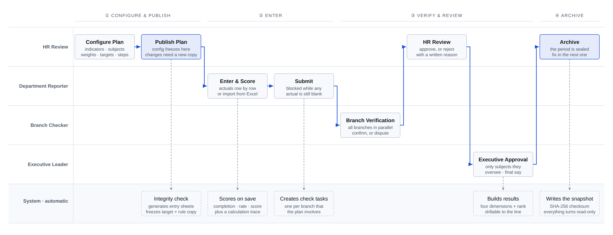
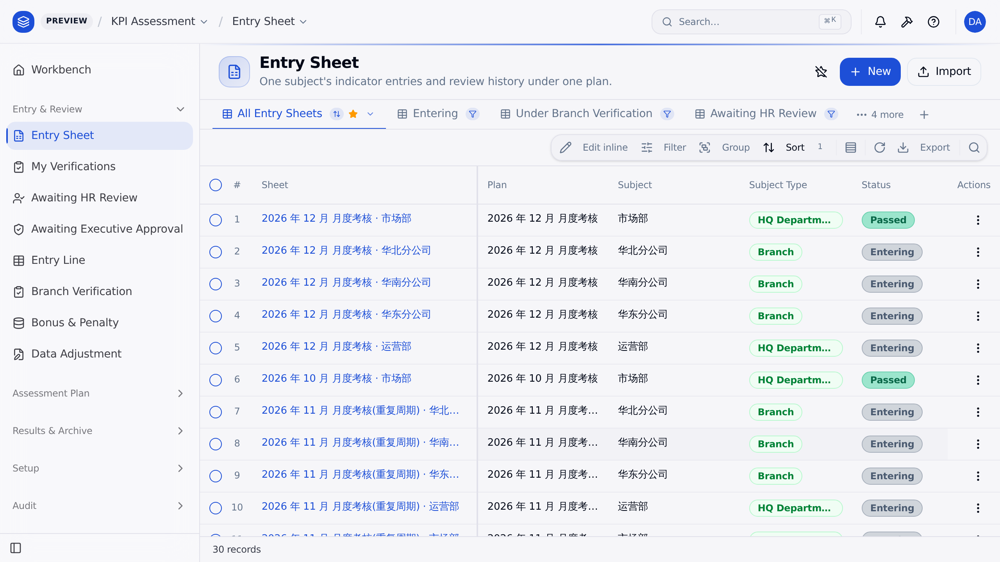
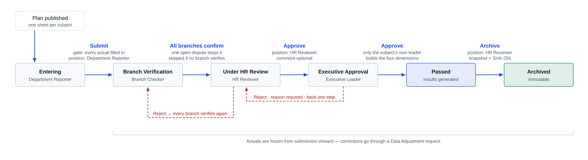

# KPI Assessment Management System

[](LICENSE)
[](https://github.com/objectstack-ai/objectstack)
[](https://nodejs.org)

A production-shaped KPI assessment system for organizations that score multiple departments and
branch companies each period. It covers the whole cycle — **indicator library → plan configuration →
indicator assignment → data entry → parallel verification → review workflow → real-time scoring →
data adjustment → four-dimension aggregation → immutable archive** — and replaces the spreadsheets
and chat threads that usually carry that process.

Built on the [ObjectStack](https://github.com/objectstack-ai/objectstack) 17.x metadata platform.
Organization, accounts, permissions, audit logging, import/export, list and form UI come from the
platform; six server-side code points carry what is specific to assessment.

> **Language note.** This system was built for a Chinese enterprise, so the domain copy is authored
> in Simplified Chinese and the delivery documents under `docs/` are Chinese throughout. The UI
> itself runs in English: every object, field, picklist value, list view, action and navigation
> label is translated (530 keys). A few surfaces are not yet covered — see
> [Internationalization](#internationalization) for exactly which.



*One assessment cycle. Solid arrows are the sheet moving between people; dashed arrows are the five
points where the system acts on its own.*



*Entry sheets queued by workflow state. The record names are Chinese because the bundled demo
dataset is — the interface is not.*

## Why this exists

Running an assessment cycle on spreadsheets fails in three predictable ways:

- **The scoring rule is not single-valued.** Every department's sheet spells "completion rate"
  slightly differently, and editing a sheet silently changes scores for periods already closed.
- **The process leaves no trail.** Who changed which number, when, why, and who approved it ends up
  scattered across chat logs and mail attachments.
- **Coordination is manual.** Branch verification, HR review and executive approval are chased by
  hand, with no single view of what is stuck where.

## Core mechanisms

| Mechanism | What it means in the code |
|---|---|
| **Single source of truth for scoring** | Four scoring methods (linear / step / range interpolation / CEL formula) are *data*, not code. Every score in the system comes out of one engine, `src/lib/scoring.ts`; re-implementing it in a view or formula field is not allowed. |
| **Freeze on publish** | Publishing a plan copies target value, weight and scoring rule onto every entry line. Later edits to the indicator library never reach back into a closed period. |
| **A state machine with gates** | Can't submit with blank actuals, can't advance with an open dispute, rejection requires a reason, everything is read-only after archiving. Rules live in server-side hooks; buttons only write a "pending action". |
| **Append-only audit trail** | Every submit, verify, review, reject, adjust and archive writes a review record that cannot be edited. Archive snapshots carry a SHA-256 checksum. |
| **Data scope generated from the plan** | "My department" and "the subjects I oversee" are computed at publish time from participating subjects, executive leaders and staff assignments — onboarding a new org changes data, not metadata. |

The trade-off worth stating up front: **free-form spreadsheet formulas and cross-sheet references do
not enter the system.** Their job is taken over by the indicator scoring rule. That is the price of
getting a single, reviewable, recomputable definition of every score.

## Quick start

Requires Node >= 22 and pnpm >= 10.15.

```bash
pnpm install
pnpm verify          # validate + typecheck + vitest + i18n sync check
pnpm dev             # http://localhost:3000 · console at /_console/ · admin@objectos.ai / admin123
pnpm e2e             # drives a full assessment cycle over REST against a running dev instance
```

`pnpm validate` checks the metadata. **Metadata errors fail silently at runtime**, so treat a failing
`validate` as a blocking error, not a warning.

The dev environment loads a demo seed automatically: an org tree (headquarters, 3 departments,
4 branches), 6 indicators including a stepped one, and 1 draft plan (4 workflow steps, 5 participating
subjects, 18 indicator assignments). **Users cannot be seeded** — create them in Setup, add them to an
org unit, and assign a position.

### Demo seed profiles (`OS_SEED_PROFILE`)

| Profile | How to enable | Contents |
|---|---|---|
| Default (generic enterprise) | unset | The set above; the operations manual's screenshots depend on it |
| Software company | `OS_SEED_PROFILE=software` | HQ + 8 business departments + 3 sales branches, 24 indicators covering all four scoring methods, 1 draft quarterly plan (11 subjects, 36 assignments) |

**Switching profiles requires an empty database** — both steps, neither optional:

1. **Delete `dist`** — the chosen profile is cached in the build output; without this you keep the old one.
2. **Point at a fresh database file** — both profiles `upsert`, and the seed loader only writes, never
   deletes. Switching on an *existing* database leaves the other profile's records in place: you end up
   with two org trees and two plans in one database, and after switching back the software profile's
   12 units and quarterly plan still show up on exactly the pages the manual's screenshots frame.

```bash
# Software profile: empty database → create positions/staff → assert the full flow
rm -rf dist
rm -f .objectstack/software.db*                 # or pick a filename you have not used
OS_SEED_PROFILE=software OS_DATABASE_URL=file:./.objectstack/software.db pnpm dev
node scripts/software-people.mjs                # 18 accounts, staff assignments, personal items, executive leaders
node scripts/software-flow.mjs [result.json]    # publish → enter → verify → review → bonus → adjust → aggregate → archive → data scope

# Back to the default profile: same two steps
rm -rf dist
OS_DATABASE_URL=file:./.objectstack/default.db pnpm dev
```

Both scripts read `KPI_BASE_URL` (default `http://localhost:${OS_PORT:-3000}`).
`software-people.mjs` is idempotent and **must run while the plan is still a draft** — staff
assignments and executive leaders freeze when the plan is published. `software-flow.mjs` requires an
empty database, because it deliberately breaks the plan first to assert that publish is blocked.

Of the 18 accounts it creates, each of the three branches gets **two**: a *branch reporter*
(position `kpi_dept_reporter`) and a *branch checker* (`kpi_branch_checker`). A branch is both an
assessed subject and a verifying party, and a checker may only confirm or dispute — never edit a
value. So a branch's own entry sheet must be filled in by its reporter, not by an administrator
(`software-flow.mjs` asserts exactly this in T11b). Their data scope has the same origin as a
department reporter's: at publish time the sharing rules written for each participating subject widen
that subject's entry sheet to the members of its unit, and a branch *is* a participating subject —
no extra metadata needed.

> ⚠️ **Temporary demo-tenant fixture.** Seeded org units are written with an empty
> `organization_id`, while units created by an administrator in Setup get stamped with the current
> organization; the sharing-rule recipient expansion compares that column for equality, so only
> seeded units expand to nobody. `src/data/align-demo-units.ts` patches those specific units at
> `kernel:bootstrapped` — that id set only, only rows with an empty `organization_id`, and only in
> dev/test. This works around objectstack-ai/objectstack#14547; delete it, along with its call in
> `objectstack.config.ts`, once the platform fix lands.

## Roles and positions

| Role | Position | Permission set | Data scope |
|---|---|---|---|
| System administrator | `kpi_admin` (org owner/admin counts automatically) | `kpi_admin_set` | Everything |
| HR reviewer | `kpi_hr_reviewer` | `kpi_hr_reviewer_set` | Everything |
| HR head | `kpi_hr_head` | `kpi_hr_head_set` | Everything |
| Department reporter | `kpi_dept_reporter` | `kpi_dept_reporter_set` | Own department (private + dynamic record sharing) |
| Branch checker | `kpi_branch_checker` | `kpi_branch_checker_set` | Own branch's check tasks (private + dynamic record sharing) |
| Executive leader | `kpi_exec_leader` | `kpi_exec_leader_set` | Subjects they oversee (private + dynamic record sharing) |

"Own department / own branch / subjects I oversee" deliberately does **not** rely on the enterprise
`hierarchy-security` plugin's `unit` / `unit_and_below` depth. Entry sheets, check tasks, adjustments
and results all have an OWD of `private`; visibility is widened by **sharing-rule data**
(`src/services/sharing-service.ts`) written at publish time from participating subjects, executive
leaders and staff assignments. Onboarding a new customer's org changes data, not metadata.

Rules are created **per plan**: the condition carries the plan id and the rule name is prefixed with
the plan, so publishing reconciles that plan's rules in one pass — replace an executive leader, drop
a participating subject or remove a staff assignment and the old grant lapses immediately, while
grants from historical plans stay untouched. Once a plan is **closed or archived** the rules shift to
"keep read, drop write": entry sheets, check tasks and adjustments go from editable to read-only
(history must stay queryable, but must not change); results were read-only already.

## Business process

Four workflow steps by default; the steps are configurable per plan. Every transition is decided by
a server-side hook — buttons only write a pending action, so writing the status field directly is
refused the same way.



- **Scoring engine** — `src/lib/scoring.ts` (linear / step / range interpolation / CEL formula).
  Saving an actual value scores it immediately and persists a human-readable calculation trace.
- **Review state machine** — `src/lib/workflow.ts` + `src/hooks/sheet.hook.ts`. Buttons only write a
  pending action; every rule lives in the hook.
- **Aggregation** — `src/lib/aggregate.ts` recomputes the department, branch, per-person and executive
  dimensions whenever a sheet passes, is archived, or an adjustment lands.
- **Audit trail** — `kpi_review_record` is append-only, on top of the platform audit log; archive
  snapshots (`kpi_snapshot`) carry a SHA-256 checksum.
- **Definitions of record** — scoring, aggregation, workflow, bonus and adjustment semantics follow
  chapters 7–10 of `docs/00-设计方案.md`. Per-person score =
  Σ(segment score × assignment weight × personal coefficient) + Σ(personal item score rate × item weight).

Publishing runs an **8-point integrity check**: workflow steps valid, at least one participating
subject, every subject has assignments, weights total 100% per subject, no missing target values,
every subject has an executive leader (when the plan has an approval step), no assignment to a
non-participating subject, and no open disputes. It is all-or-nothing — a failing check leaves the
plan a draft and lists every problem.

## Project layout

```
objectstack.config.ts   App assembly: objects, views, actions, hooks, permissions,
                        sharing rules, dashboards, reports, seed data
src/objects             17 business objects
src/hooks               Scoring, workflow, publish, disputes, bonus, adjustment, immutability
src/lib                 Pure functions: scoring / state machine / aggregation / CEL (unit-tested)
src/services            Scoring assembly, result aggregation, snapshot generation, sharing rules
src/security            Positions, permission sets, sharing rules, position binding
src/views | actions | apps | pages | datasets | dashboards | reports | translations | data
test                    Vitest unit tests (139 cases)
scripts/e2e-flow.mjs    End-to-end flow verification over REST
docs                    Design, manual and briefing documents (Simplified Chinese)
```

## Conventions

Full detail in [CLAUDE.md](CLAUDE.md). The load-bearing ones:

- Object machine names are prefixed `kpi_`; fields are `snake_case`, config keys are `camelCase`.
- Number fields must declare all four of scale, minimum, maximum and unit — platform defaults are banned.
- The scoring definition lives only in `src/lib/scoring.ts`; the review state machine only in
  `src/hooks/sheet.hook.ts`. No second implementation in views or formula fields.
- Archive snapshots and passed entry sheets are read-only; do not write around the hooks.
- Do not modify platform packages under `node_modules`. Platform limitations are **reported only**
  as issues on objectstack-ai/objectstack (symptom, minimal repro, expected capability, version) —
  no fix PRs there. Application-side workarounds must be environment-gated and annotated with the
  platform issue they track, and deleted once it is fixed.
- Metadata labels are authored in Simplified Chinese (`Field.number({ label: '实际值', … })`), which
  fills the `zh-CN` bundle verbatim — never hand-edit its entries. The `en` leaves are translated by
  hand; change a Chinese label and you must re-translate its English counterpart yourself.

## Internationalization

`objectstack.config.ts` declares `defaultLocale: 'zh-CN'`, `supportedLocales: ['zh-CN', 'en']` and
`fallbackLocale: 'zh-CN'`. Both bundles carry **530 keys** and are generated by `pnpm i18n:extract`
(`os i18n extract --locales=zh-CN,en --fill=default`), with `pnpm verify` failing on a stale bundle.

| Bundle | Keys | How the leaves are filled |
|---|---|---|
| `zh-CN` | 530 | Copied verbatim from the metadata labels — **never hand-edit** |
| `en` | 530 | Seeded from the Chinese source, then translated by hand |

**Covered in English:** object, field and picklist labels; object descriptions; list views; record
actions; app navigation; dashboard titles and widget titles; page titles.

**Not covered, and why:**

| Surface | Why | Where it lives |
|---|---|---|
| Dataset field labels (the captions under dashboard metrics) | Outside the extractor's scope | `src/datasets/index.ts` |
| Dashboard filter labels and their options | Outside the extractor's scope | `src/dashboards/index.ts` |
| Workbench page body copy and block headings | Page *component properties* are not extracted; only a page's label/title/subtitle are | `src/pages/index.ts` |
| The three-part error messages raised by hooks | Plain strings in code, not metadata | `src/hooks/*.ts` |
| The bundled demo dataset (org units, indicator names, units) | It is data, not copy | `src/data/*.ts` |

The first three are platform extractor gaps rather than missing translations. Closing the last one
would mean an English demo seed profile alongside the existing two. Contributions welcome — please
raise an issue first so the scope can be agreed.

**Re-translating after a label change.** Merge only fills *gaps*: if you change a Chinese metadata
label, the matching English leaf already holds a translation, so it is left alone and silently goes
stale. Nothing warns you. Re-translate it by hand when you change the source.

## Documentation

All documents are in Simplified Chinese.

| Document | Contents |
|---|---|
| [docs/需求/KPI考核管理系统-功能性需求文档-V1.3.md](docs/需求/KPI考核管理系统-功能性需求文档-V1.3.md) | Original functional requirements from the customer (V1.3) |
| [docs/00-设计方案.md](docs/00-设计方案.md) | Design specification — V1.0 is the customer-confirmed baseline and the single source of requirements. Word builds in [docs/交付/](docs/交付/), generated from this source by `pnpm docs:docx` |
| [docs/01-需求解读报告.md](docs/01-需求解读报告.md) | Scenario map, platform capability coverage, risks, open questions (closed by design spec V1.0) |
| [docs/02-总体方案蓝图.md](docs/02-总体方案蓝图.md) | Platform capability mapping, object model, module dependencies and build order |
| [docs/手册/KPI考核管理系统-操作手册.md](docs/手册/KPI考核管理系统-操作手册.md) | Operations manual, one chapter per business role, with real UI screenshots. Word build via `pnpm docs:manual` |
| [docs/汇报/KPI考核管理系统-解决方案汇报.html](docs/汇报/KPI考核管理系统-解决方案汇报.html) | Solution briefing: nine diagrams covering the process, scoring, aggregation and permission model, plus 26 UI screenshots. Self-contained single file via `pnpm docs:report` |
| [scripts/build-report-deck.mjs](scripts/build-report-deck.mjs) | Generates a 19-slide briefing deck from the same material, with speaker notes. See the script header for usage and dependencies |
| [docs/readme/diagrams.en.html](docs/readme/diagrams.en.html) | Source for the two English diagrams above. Re-export by screenshotting each `figure` with a headless browser at 2× |
| [CLAUDE.md](CLAUDE.md) | Development conventions and delivery-process checklist |

## Contributing

Issues and pull requests are welcome. Before opening a PR, run `pnpm verify` — it must pass; a failing
`pnpm validate` in particular means broken metadata, which fails silently at runtime rather than
loudly at startup.

## License

[Apache-2.0](LICENSE)
