

# KPI 考核管理系统

# 操作手册

 

**版本号:V0.1(送审稿)**

**发布日期:2026 年 09 月 03 日**

 

**编制方:(待项目经理填写单位全称)**

**客户方:(待项目经理填写单位全称)**

---

## 版本记录

| 版本号 | 日期 | 修订说明 | 编制人 | 审核/确认 |
|---|---|---|---|---|
| V0.1 | 2026-09-03 | 初稿:按《设计方案》V1.0 第 3 章的六个业务角色分章成册,覆盖登录、方案配置、指标下达、填报、核对、审核、加减分、数据调整、归档与审计查询;全部截图取自演示环境真实界面,并用红框与序号标注操作位置;附手册章节与界面对照索引、各角色练习任务清单 | AI 文档工程师 | 待业务顾问审 |

依据文件:《KPI 考核管理系统 设计方案》V1.0(2026-09-02 客户方确认版)、《KPI 考核管理系统 功能性需求文档》V1.3(2026-09-02)。

---

## 目录

1. 通用操作
2. 人力审核
3. 部门填报人员
4. 分公司核对人员
5. 人力负责人
6. 分管领导
7. 常见问题总表
   附录 A 手册章节与界面对照索引
   附录 B 各角色练习任务清单

---

# 1. 通用操作

本章的内容对所有角色通用。各角色在读本章之后,直接翻到自己那一章。

**表 1 本手册涉及的角色与对应章节**

| 角色 | 在系统里主要做什么 | 对应章节 |
|---|---|---|
| 人力审核 | 维护指标库与考核方案、指标下达、发布方案、人力节点审核、登记加减分、审批数据调整、归档、审计查询 | 第 2 章 |
| 部门填报人员 | 填报本部门数据并提交、发起数据调整申请 | 第 3 章 |
| 分公司核对人员 | 核对与本分公司相关的填报数据,确认无误或提出争议 | 第 4 章 |
| 人力负责人 | 审批加减分、审批数据调整 | 第 5 章 |
| 分管领导 | 分管主体的最终审批、查看分管主体的考核结果与看板 | 第 6 章 |
| 系统管理员 | 维护组织、用户与岗位 | 不在本册,另见系统管理员说明 |

## 1.1 登录系统

**场景引入**:每天上班后第一件事,用本人账号登录系统,查看有没有等着自己处理的单据。

**操作步骤**

1. 在浏览器地址栏输入单位提供的系统网址,回车。
2. 在「邮箱」中输入本人邮箱(见图 1 标注 1)。账号与初始密码由管理员发放。
3. 在「密码」中输入密码(标注 2)。
4. 点「登录」(标注 3)。

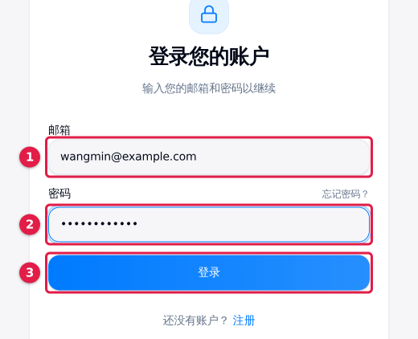

图 1 登录页面的「邮箱」「密码」输入框与「登录」按钮

**结果确认**:登录成功后进入「工作台」页面,页面右上角显示本人姓名首字的头像。

**常见问题**

- 提示邮箱或密码不正确:先确认邮箱有没有多打空格;仍不成功,请联系管理员重置密码。
- 登录后看不到「KPI 考核管理」的菜单:说明本人账号还没有分配考核岗位,请联系管理员分配岗位。

## 1.2 认识工作台与左侧菜单

**场景引入**:第一次使用系统时,先认清楚菜单结构,后面找功能就不用问人。

**操作步骤**

1. 登录后默认进入「工作台」(见图 2 标注 1),这里有全流程的顺序说明和各角色的操作提示。
2. 左侧是功能菜单,按「填报与审核」「考核方案」「结果与归档」「基础设置」「审计查询」五组归类(标注 2),点分组名展开。
3. 右上角头像是个人菜单(标注 3),里面有「个人资料」「语言」「注销」。

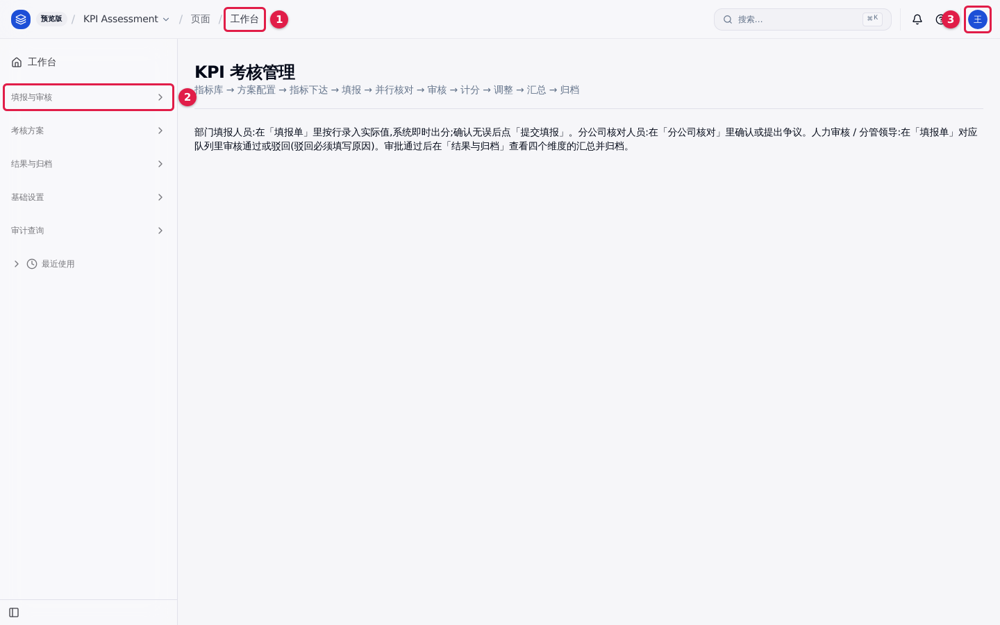

图 2 工作台页面与左侧功能菜单分组

**结果确认**:能在左侧菜单里找到自己那一章要用的菜单项,即为认清。

**常见问题**

- 左侧菜单项比手册里写的少:每个角色只看得到自己权限内的菜单,这是正常的。
- 界面上部分列头显示为英文:这是当前送审版本的已知问题,本手册在这些位置同时给出列头原文与业务含义,不影响操作。

## 1.3 切换应用

**场景引入**:同一个账号可能同时开通了几个业务系统,需要在它们之间来回切换。

**操作步骤**

1. 点页面顶部左侧的应用名(见图 3 标注 1),打开「切换应用」列表。
2. 在列表中点要进入的应用名。

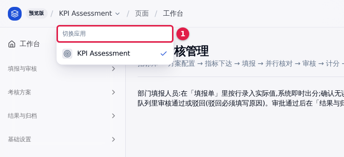

图 3 顶部应用名下拉出的「切换应用」列表

**结果确认**:页面顶部的应用名变成所选应用,左侧菜单同步变成该应用的菜单。

**常见问题**

- 列表里只有一个应用:说明本人账号只开通了这一个应用。

## 1.4 看懂待办队列

**场景引入**:每天上班后先看一眼与自己有关的队列,判断今天要处理哪些单子。

**操作步骤**

1. 点左侧菜单「填报与审核」→「填报单」。
2. 列表上方是一排队列页签:「全部填报单」「填报中」「分公司核对中」「待人力审核」(见图 4 标注 1)。
3. 页签放不下时,右侧会出现「还有 N 个」(标注 2),点它可以看到「待领导审批」「已通过」「已归档」「流程看板」。
4. 点某个队列页签,列表只显示该状态的填报单。

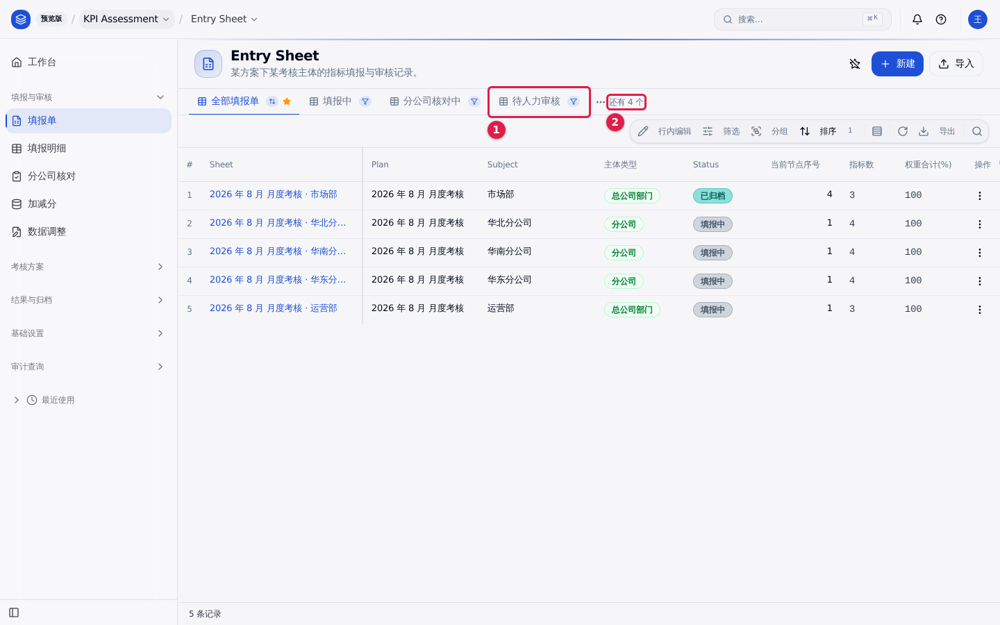

图 4 填报单列表的队列页签与「还有 4 个」入口

**结果确认**:点某个队列后,列表中每一行的「Status」(状态)列都与页签名称一致。

**常见问题**

- 找不到「待领导审批」页签:它在「还有 N 个」里,点开即可。
- 队列里没有单子:说明当前没有处于该状态、且本人有权查看的填报单。

## 1.5 修改密码

**场景引入**:管理员发放初始密码后,第一次登录应当立即改成本人记得住、别人猜不到的密码。

**操作步骤**

1. 点右上角头像 →「个人资料」。
2. 滚动到「修改密码」区域。
3. 在「当前密码」输入现在使用的密码(见图 5 标注 1)。
4. 在「新密码」与「确认密码」输入两遍新密码(标注 2)。
5. 点「修改密码」(标注 3)。

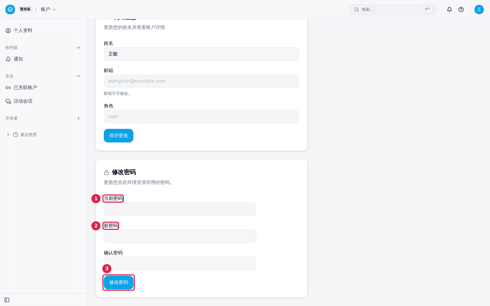

图 5 个人资料页的「修改密码」区域

**结果确认**:页面提示修改成功;下次登录用新密码。

**常见问题**

- 提示两次输入不一致:请重新输入「确认密码」。
- 忘记当前密码:请联系管理员重置。

## 1.6 导出 Excel

**场景引入**:需要把系统里的清单交给上级或存档时,把当前列表导出成 Excel。

**操作步骤**

1. 打开任意一个列表页(填报单、填报明细、指标下达、考核结果等)。
2. 点列表右上角工具条中的「导出」(见图 6 标注 1)。
3. 在下拉中选「导出为 XLSX」(Excel 文件)或「导出为 CSV」。

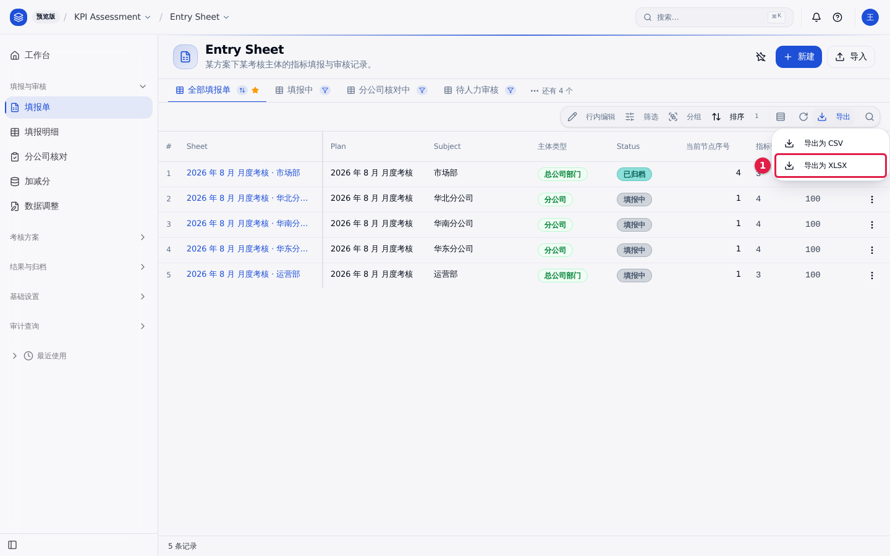

图 6 列表工具条「导出」下拉中的「导出为 CSV」与「导出为 XLSX」

**结果确认**:浏览器下载一个文件,打开后内容与当前列表的可见列一致。

**常见问题**

- 导出的内容比屏幕上看到的少:导出按当前队列页签与筛选条件执行,先取消筛选再导出。
- 没有「导出」按钮:该列表对本人角色未开放导出,请联系管理员。

---

# 2. 人力审核

本章按「先建指标 → 再配方案 → 发布 → 审核 → 加减分与调整 → 归档 → 查审计」的顺序编排,与一次考核周期的实际工作顺序一致。

## 2.1 维护指标库

**场景引入**:新的考核周期开始前,先把本期要用的指标准备好。指标只建一次,以后各期方案都从指标库里选。

**操作步骤**

1. 点左侧菜单「基础设置」→「指标库」(见图 7 标注 1),打开指标列表。
2. 列表上方有两个视图页签:「全部指标」与「启用中」。
3. 新增一条指标点「新建」(标注 2);从 Excel 批量导入点「导入」(标注 3);把当前清单导出点「导出」(标注 4)。

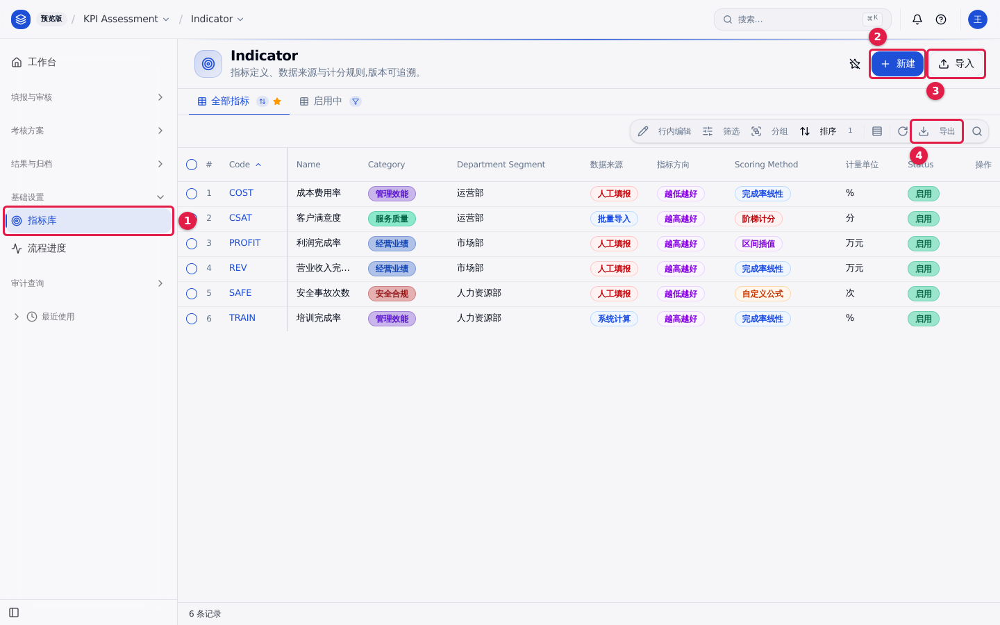

图 7 指标库列表与「新建」「导入」「导出」按钮

4. 点「新建」后弹出建档窗口,上半部分是「基本信息」:填「Code」(指标编码,标注 1)、「Name」(指标名称,标注 2),再选「Category」(指标类别)、「Department Segment」(部门板块)、「数据来源」与「Status」(状态)。
5. 往下是「计分规则」区(标注 3):选「指标方向」(越高越好 / 越低越好)与「Scoring Method」(计分方式),并填「完成率封顶(%)」「完成率保底(%)」。

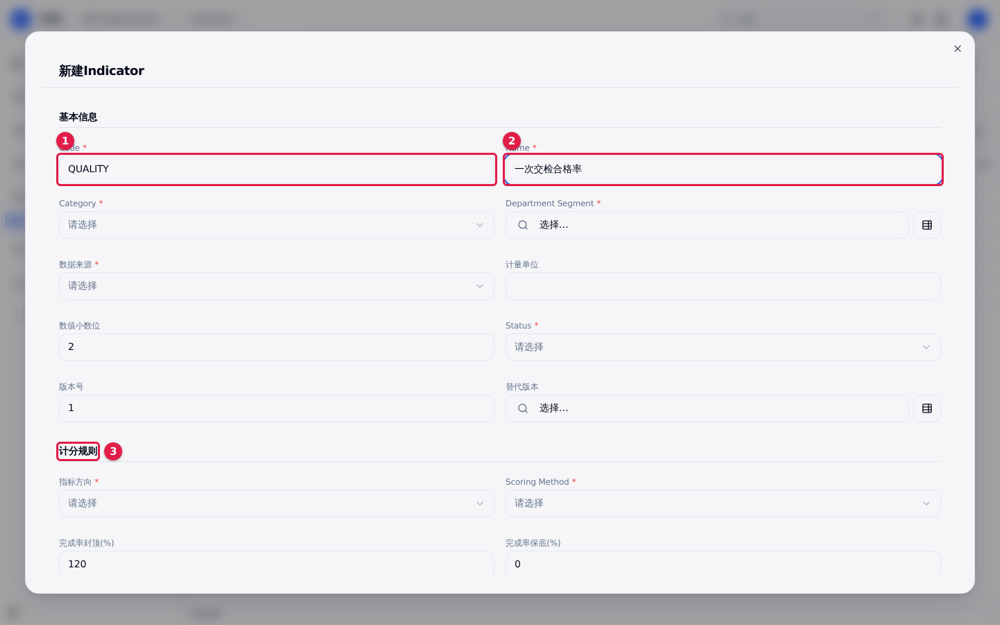

图 8 新建指标窗口的「基本信息」与「计分规则」

6. 计分方式选「阶梯计分」时,继续往下到「阶梯区间」表格(见图 9 标注 1),按行填「区间名称」「完成率下限(%,含)」「完成率上限(%,不含;空为无上限)」「得分率(%)」;要加一行点表格下方的「Add line」(新增行,标注 2)。
7. 全部填完点「创建」(标注 3)。

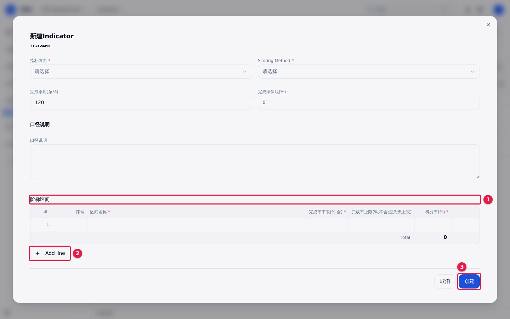

图 9 新建指标窗口下部的「阶梯区间」表格与「创建」按钮

**四种计分方式的填法**

**表 2 计分方式与需要填的参数**

| 计分方式 | 得分率怎么来 | 还要填什么 |
|---|---|---|
| 完成率线性 | 完成率限定在「保底」与「封顶」之间,直接当作得分率 | 完成率封顶(%)、完成率保底(%) |
| 阶梯计分 | 完成率落在哪个区间,就取该区间的得分率 | 阶梯区间各行 |
| 区间插值 | 区间下限得 0 分,完成率 100% 得满分,区间上限得封顶分,中间按直线插值 | 区间下限完成率(%)、区间上限完成率(%) |
| 自定义公式 | 由公式直接算出得分 | 计分公式 |

完成率的算法:指标方向为「越高越好」时,完成率 = 实际值 ÷ 目标值;为「越低越好」时,完成率 = 目标值 ÷ 实际值。指标得分 = 权重 × 得分率。

**结果确认**:回到指标列表能看到新建的指标,「Status」为「启用」。点开指标可以看到「计分规则」相关字段(见图 10 标注 1),阶梯区间在「相关」页签下(标注 2)。

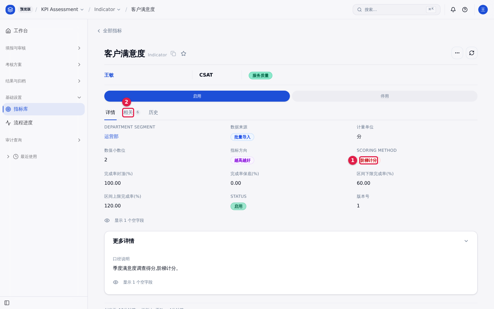

图 10 客户满意度指标详情页的计分方式与「相关」页签

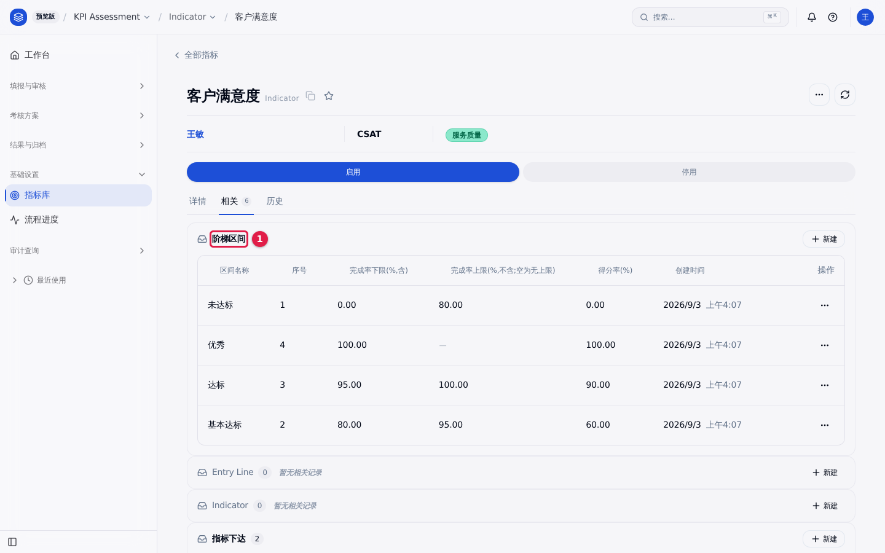

图 11 指标「相关」页签下的阶梯区间四行

**常见问题**

- 提示指标编码重复:指标编码全系统唯一,换一个编码。
- 指标口径变了怎么办:不要改历史指标,新建一条新版本指标,把旧指标的「Status」改成「停用」,并在旧指标的「替代版本」里指向新指标。
- 停用的指标还能用吗:已发布方案里已经下达的指标不受影响;新方案里选不到停用指标。

## 2.2 新建 / 复制方案版本

**场景引入**:每个考核周期开一个方案版本。第二期开始,直接复制上一期的方案版本再改数,比从头配快得多。

**操作步骤**

1. 点左侧菜单「考核方案」→「方案版本」(见图 12 标注 1),打开方案列表。
2. 点「新建」(标注 2)。列表上方的「草稿」页签(标注 3)可以只看未发布的方案。

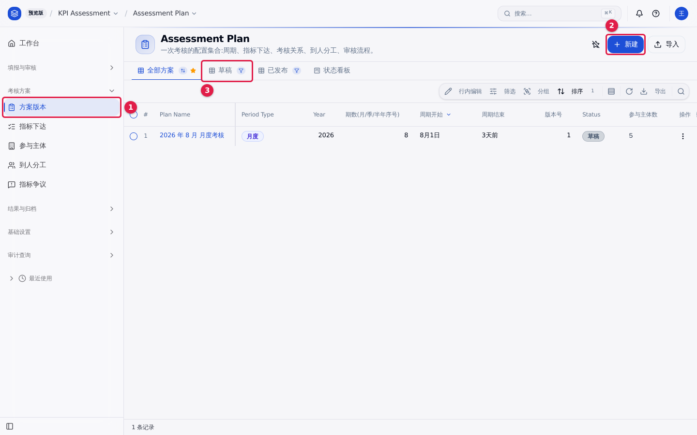

图 12 方案版本列表与「新建」按钮、「草稿」页签

3. 在建档窗口上部的「方案信息」里填「Plan Name」(方案名称,见图 13 标注 1),选「Period Type」(周期类型)、填「Year」(年度)、「期数(月/季/半年序号)」、「周期开始」「周期结束」。
4. 要复制上一期的配置,在「复制自版本」中选中上一期的方案(标注 2)。选中后,保存时系统会把该方案的流程节点、参与主体、指标下达、到人分工与个人承接项一并复制过来。

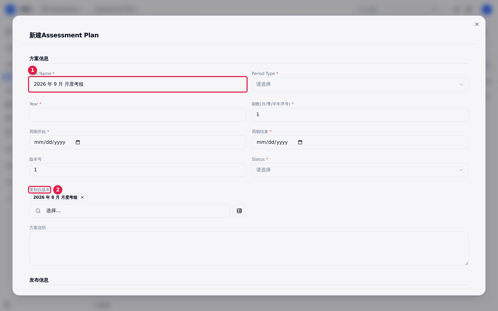

图 13 新建方案版本窗口的「方案信息」与「复制自版本」

5. 同一个窗口往下有四张明细表格,可以在建档时一次配齐:「指标下达」(见图 14 标注 1)与「审核流程节点」(标注 2)。

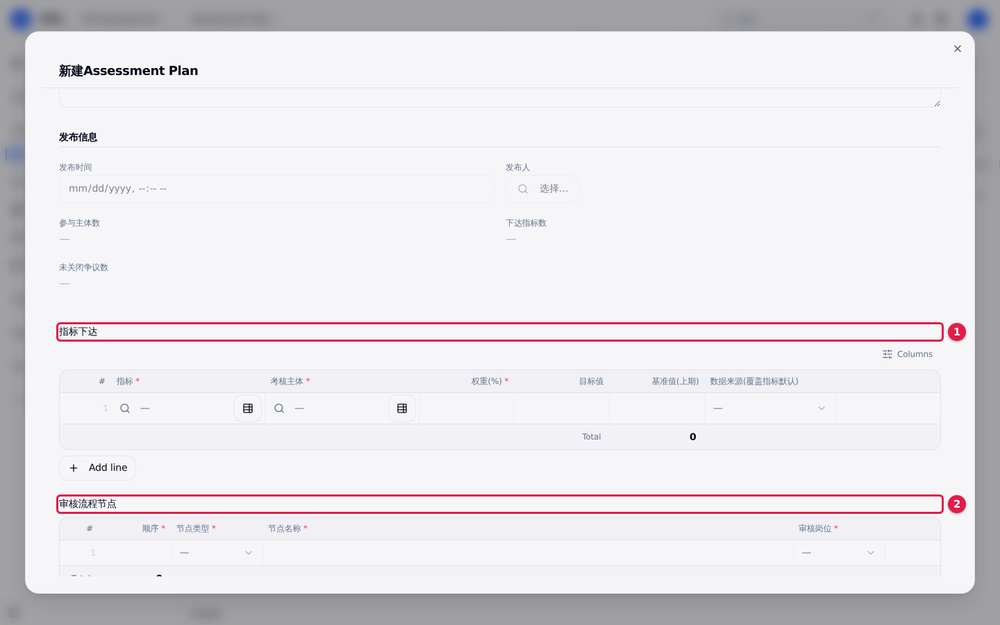

图 14 新建方案版本窗口中的「指标下达」与「审核流程节点」表格

6. 继续往下是「参与主体与考核关系」(见图 15 标注 1)与「到人分工」(标注 2)。每张表格都用它下方的「Add line」(新增行)加行。
7. 全部填完点「创建」(标注 3)。

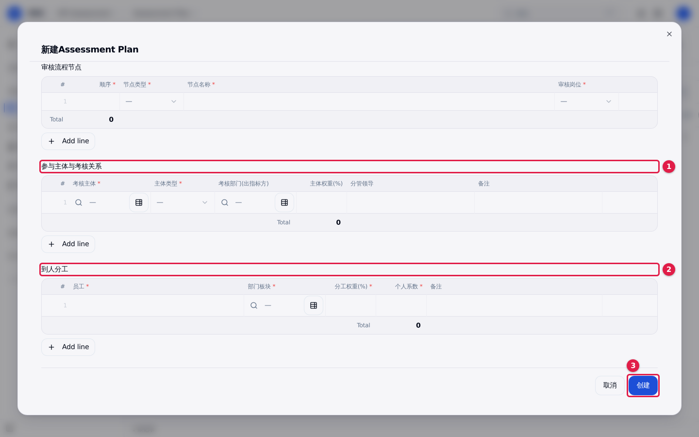

图 15 新建方案版本窗口中的「参与主体与考核关系」「到人分工」表格与「创建」按钮

**结果确认**:回到方案列表能看到新方案,状态为「草稿」。点开方案进入方案详情页(见图 16),页面上方是状态条(标注 2),右上角是「发布方案」按钮(标注 1),「相关」页签(标注 3)里是四张明细表。

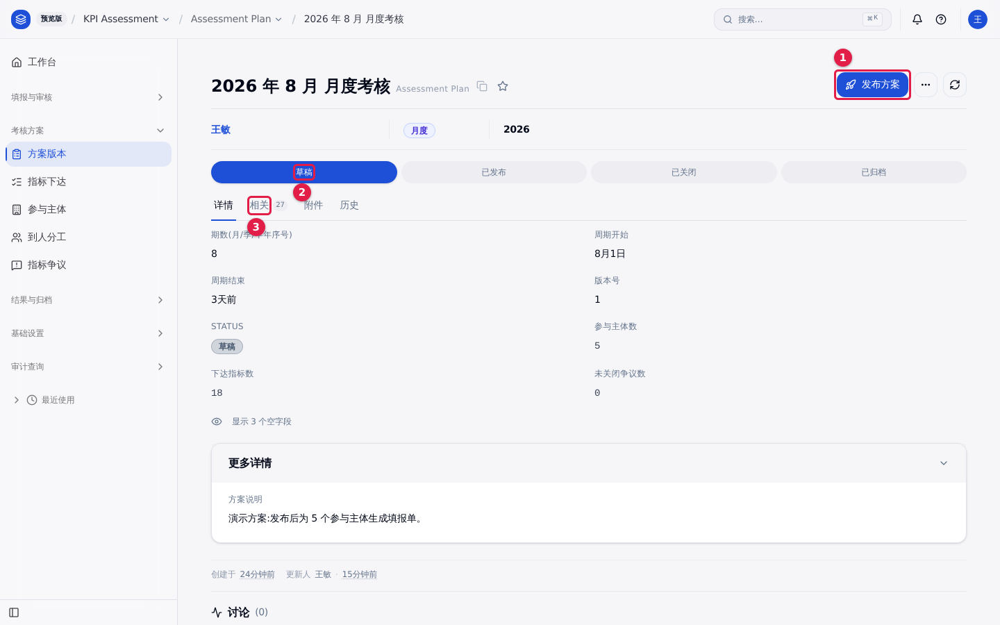

图 16 草稿状态的方案详情页与「发布方案」按钮

**常见问题**

- 复制过来的目标值还是上一期的:复制会把上一期的目标值同时写进新方案的「基准值(上期)」,本期目标值要按 2.5 节逐条改。
- 同一周期已经有生效版本:一个考核周期只允许一个已发布版本,先关闭旧版本,或者用复制出的新版本替换。
- 建档窗口太长找不到按钮:窗口内部可以滚动,「创建」在最下方。

## 2.3 配置审核流程节点

**场景引入**:方案发布前,先确认这一期走几个审核环节、每个环节由哪个岗位处理。

**操作步骤**

1. 打开方案详情页,点「相关」页签。
2. 找到「流程节点」区域(见图 17 标注 1),这里按顺序列出本方案的审核环节。
3. 要加一个环节点该区域右上角的「新建」;要改一行,点该行打开后修改。
4. 每个节点要填:「顺序」「节点类型」「节点名称」「审核岗位」。

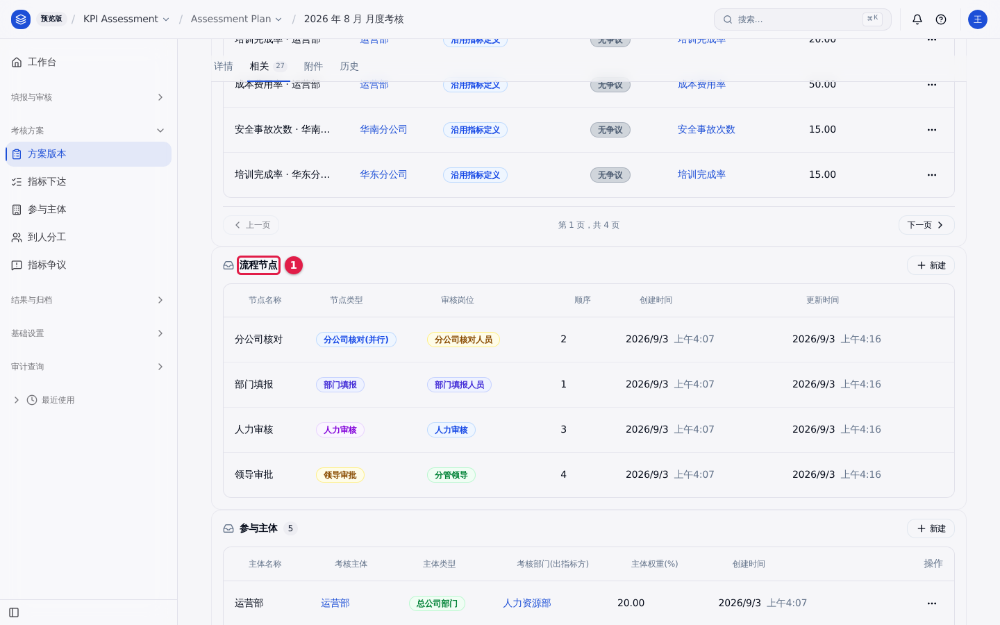

图 17 方案「相关」页签下的流程节点四行

**表 3 四种节点类型与默认审核岗位**

| 节点类型 | 节点做什么 | 审核岗位 |
|---|---|---|
| 部门填报 | 部门填报人员录入实际值并提交 | 部门填报人员 |
| 分公司核对(并行) | 各分公司并行核对,全部确认后自动推进 | 分公司核对人员 |
| 人力审核 | 人力审核通过或驳回 | 人力审核 |
| 领导审批 | 分管领导最终审批 | 分管领导 |

**结果确认**:流程节点区域按「顺序」列出各节点,顺序从 1 开始且不重复。发布时系统会校验节点配置,不合法会拦下并提示。

**常见问题**

- 本期不需要分公司核对:把「分公司核对」这一行删掉即可,方案发布后填报单提交将直接进入人力审核。
- 节点顺序填重了:发布时会被拦下,回到本区域把顺序改成不重复的数字。

## 2.4 配置参与主体与考核关系

**场景引入**:确定本期考核哪些部门与分公司、每个主体由谁分管、主体在公司整体里占多大权重。

**操作步骤**

1. 打开方案详情页,点「相关」页签,找到「参与主体」区域(见图 18 标注 1)。
2. 每一行是一个考核主体,要填:「考核主体」「主体类型」(总公司部门 / 分公司)、「考核部门(出指标方)」「主体权重(%)」「分管领导」。
3. 也可以点左侧菜单「考核方案」→「参与主体」,在独立列表里维护。

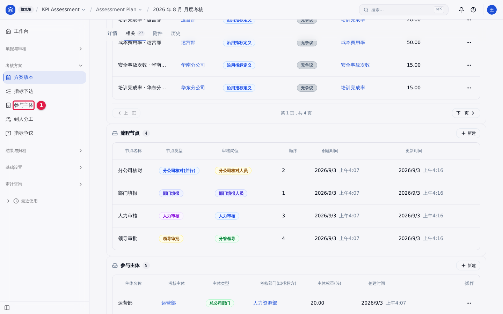

图 18 方案「相关」页签下的参与主体五行

4. 设置分管领导:在「参与主体」列表里双击该主体行的「分管领导」单元格(见图 19 标注 1),输入姓名中的一个字,在下拉出的候选人中点选目标人员(标注 2)。

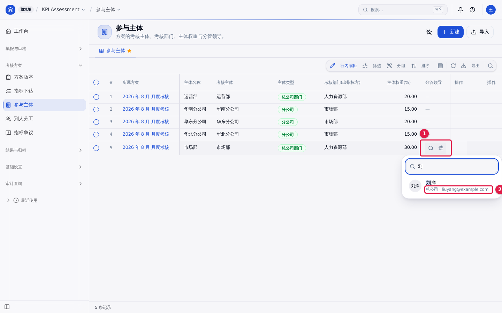

图 19 双击「分管领导」单元格后按姓名筛选出的候选人

5. 选好之后单元格显示所选人员(见图 20 标注 1),点列表工具条上出现的「全部保存」按钮完成保存(标注 2)。

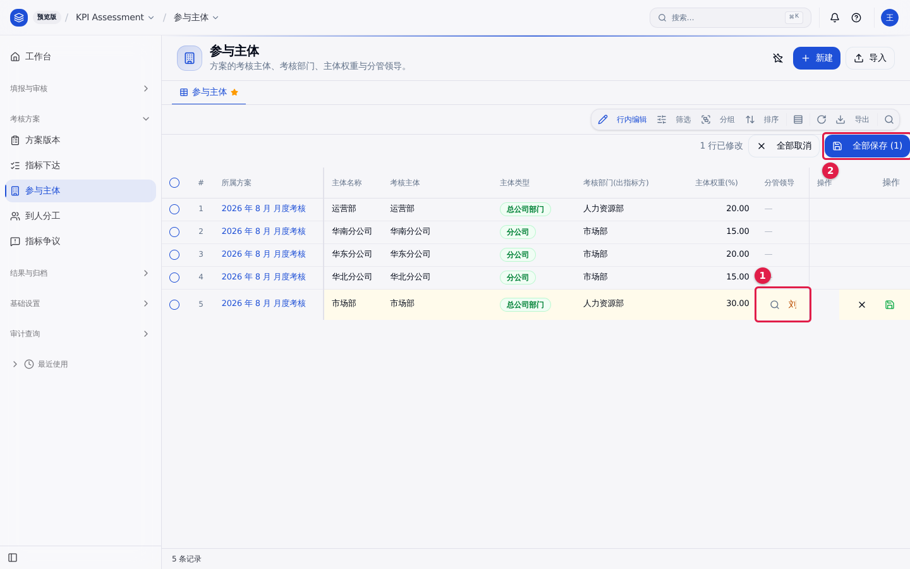

图 20 选定分管领导后出现的「全部保存」按钮

**结果确认**:刷新列表后,该主体行的「分管领导」显示所选人员姓名。方案发布后,该分管领导就能在自己的队列里看到这个主体的填报单。

**常见问题**

- 改完没保存就离开了页面:列表里的行内修改要点「全部保存」才写入,离开页面修改会丢失。
- 候选人里找不到某人:该人员还没有在系统里建账号或还没有分配「分管领导」岗位,请联系管理员。
- 「主体权重(%)」留空可以吗:可以。分管领导维度汇总时,权重全空按算术平均计算。

## 2.5 指标下达

**场景引入**:方案的核心一步 —— 给每个考核主体分配指标、权重与目标值。每个主体的权重合计必须等于 100%,否则方案发不出去。

**操作步骤(网格逐条录入)**

1. 点左侧菜单「考核方案」→「指标下达」,打开指标下达列表。
2. 列表默认处于行内编辑状态(见图 21 标注 1)。双击要改的单元格,例如「目标值」(标注 2),直接输入新值。
3. 改完点工具条上的「全部保存」(标注 3)。

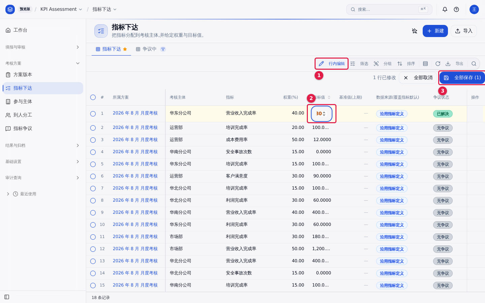

图 21 双击「目标值」单元格改为 380 后出现的「全部保存」按钮

**操作步骤(导出模板 → 填 → 批量导入)**

4. 点列表工具条的「导出」,选「导出为 XLSX」(见图 22 标注 1),得到一份带现有数据的 Excel。

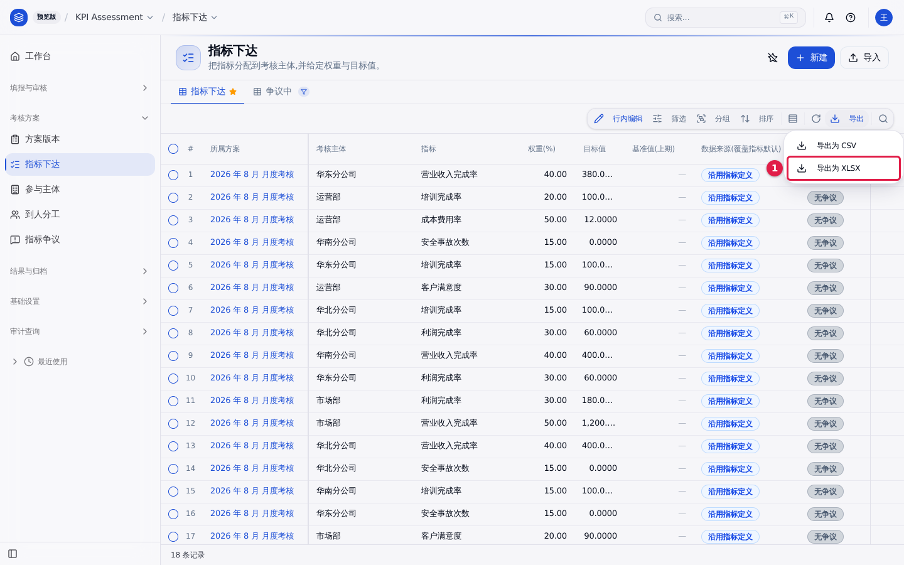

图 22 指标下达列表「导出」下拉中的「导出为 XLSX」

5. 在 Excel 中填好各主体的指标、权重与目标值后保存。
6. 回到指标下达列表,点右上角「导入」,弹出「导入指标下达」窗口。第一次导入建议先点「下载模板」(见图 23 标注 1)取得带正确列名的空表。
7. 点「选择文件」选中填好的文件(标注 2),或直接把文件拖到虚线框里,然后按窗口上方的「1. 上传 → 2. 字段映射 → 3. 预览」三步走完。

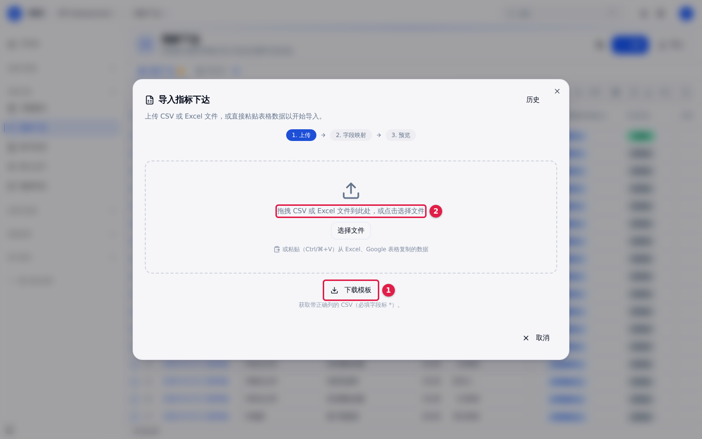

图 23 「导入指标下达」窗口的上传区、「下载模板」与三步指引

**结果确认**:列表中该主体的各行权重合计等于 100,目标值与 Excel 中一致。方案详情页的「下达指标数」随之变化。

**常见问题**

- 权重合计不是 100%:发布时会被逐条拦下,回到本列表把该主体的各行权重调整到合计 100。
- 目标值留空:除自定义公式类指标外,目标值不能为空,发布时会被拦下。
- 方案已发布还能改吗:不能。已发布方案的配置已冻结,要改就复制出新版本。

## 2.6 到人分工与个人承接项

**场景引入**:部门得分要落到人头上时,给每位员工配置他承担的部门板块比例;员工个人直接承担的指标另外登记为个人承接项。

**操作步骤**

1. 点左侧菜单「考核方案」→「到人分工」,点「新建」。
2. 在窗口里选「所属方案」,选「员工」(见图 24 标注 1),选「部门板块」。
3. 填「分工权重(%)」(标注 2)和「个人系数」(标注 3)。

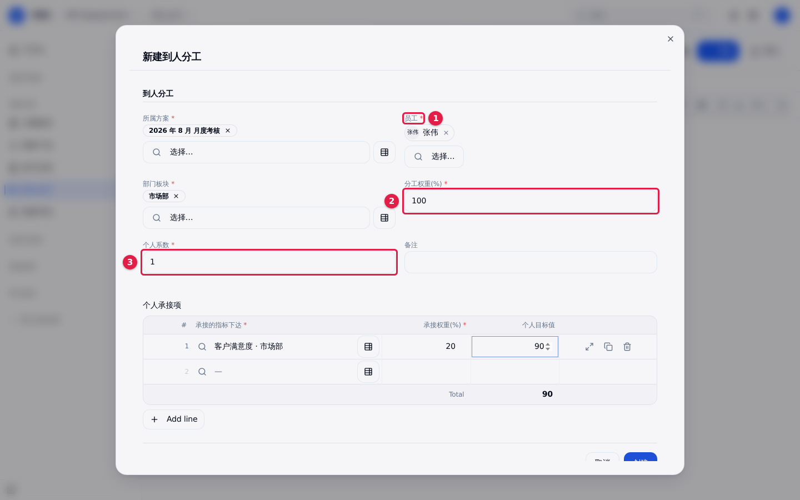

图 24 新建到人分工窗口的「员工」「分工权重(%)」「个人系数」

4. 同一个窗口下方是「个人承接项」表格(见图 25 标注 1)。要登记该员工直接承担的指标,点「Add line」(新增行)加一行,选「承接的指标下达」,填「承接权重(%)」与「个人目标值」。
5. 点「创建」(标注 2)。

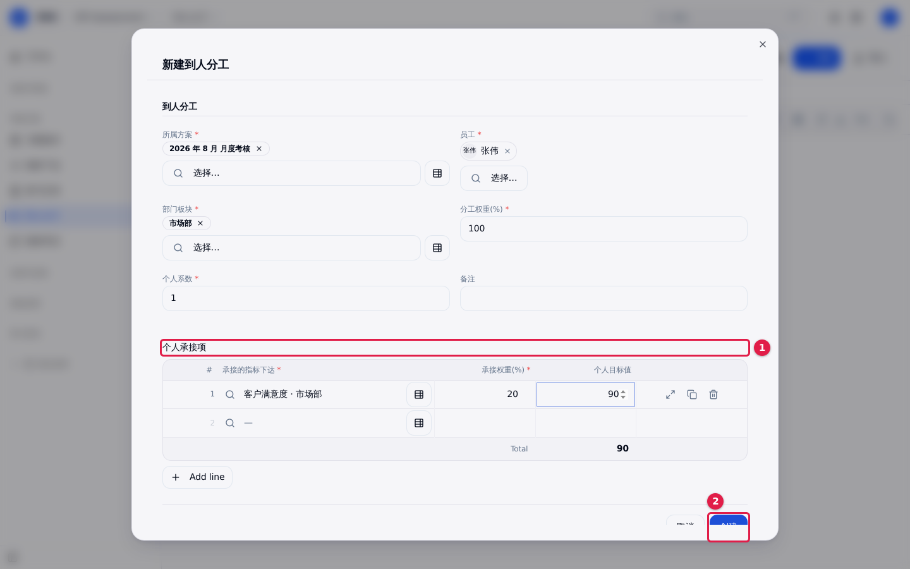

图 25 新建到人分工窗口下部的「个人承接项」表格与「创建」按钮

**到人得分口径**:到人得分 = Σ(部门板块得分 × 分工权重 × 个人系数) + Σ(承接项得分率 × 承接权重)。

**结果确认**:到人分工列表出现新记录,名称形如「姓名 · 部门」。方案发布并审批通过后,「结果与归档」→「考核结果」的「到人」维度会出现该员工的得分。

**常见问题**

- 员工选不到:该员工还没有在系统里建账号,请联系管理员。
- 个人系数填多少:默认填 1.00;需要按岗位差异调节时再改。

## 2.7 处理指标争议

**场景引入**:方案还是草稿时,分公司对某项下达的目标值有异议,提出了争议。方案有未关闭的争议就发不出去,必须逐条处理完。

**操作步骤**

1. 点左侧菜单「考核方案」→「指标争议」,点「待处理」页签(见图 26 标注 1),只看未关闭的争议。
2. 看清「争议的指标下达」「提出单位」「提出人」与「争议理由」。
3. 与业务部门核实后,点该行右侧的操作菜单(标注 2),在菜单中选「采纳」或「不采纳」。

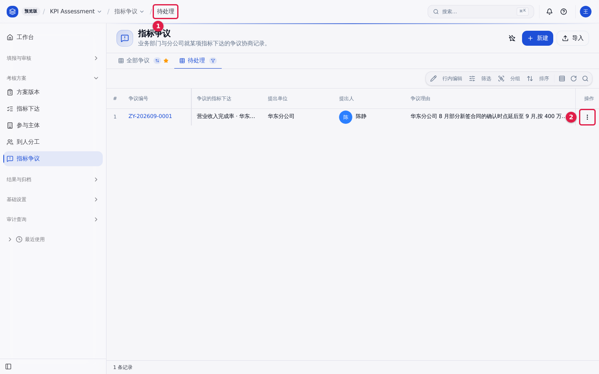

图 26 指标争议「待处理」队列与行操作菜单入口

4. 在弹出的窗口里填「处理结论(必填)」(见图 27 标注 1),写清处理意见。
5. 点「确认」(标注 2)。

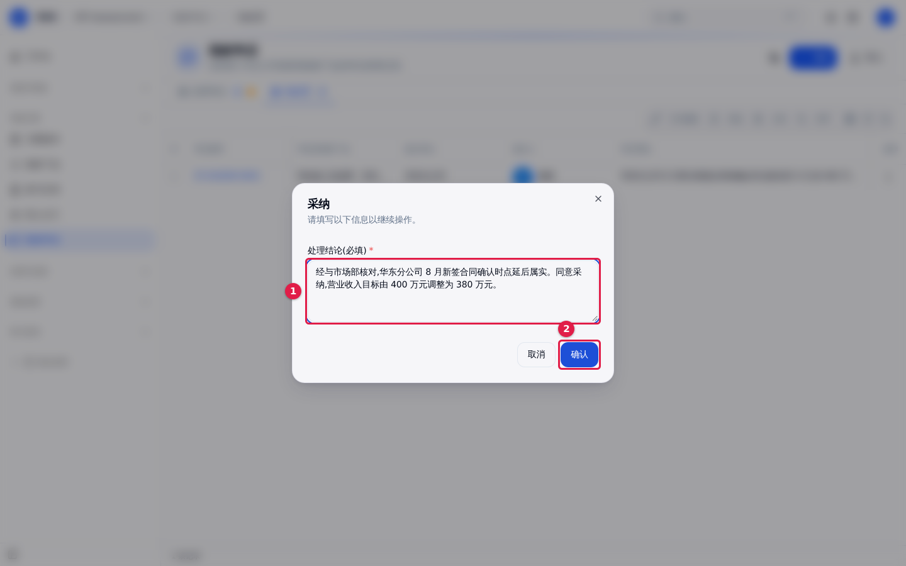

图 27 「采纳」窗口的「处理结论(必填)」与「确认」按钮

**结果确认**:该争议的状态变为已处理,对应指标下达的「争议状态」从「争议中」变成「已解决」,方案详情页的「未关闭争议数」减少。采纳的,还要按 2.5 节把目标值改过来。

**常见问题**

- 处理结论没填就点确认:系统会提示处理结论不能为空,补填后再提交。
- 已发布的方案还能提争议吗:不能。方案发布后指标下达已冻结,分公司如有异议,走填报阶段的核对与数据调整。

## 2.8 发布方案

**场景引入**:配置全部完成、争议全部关闭后,把方案发布出去,系统为每个参与主体生成一张填报单,填报工作正式开始。

**操作步骤**

1. 打开方案详情页,点右上角「发布方案」。
2. 在确认窗口中点「继续」(见图 28 标注 1)。

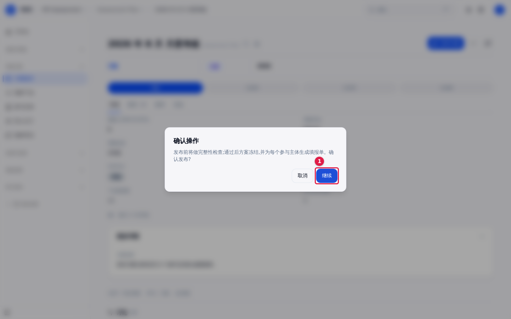

图 28 「发布方案」的确认窗口与「继续」按钮

3. 系统先做发布前完整性检查。**检查不通过时,方案保持草稿状态,并在右下角逐条列出问题**(见图 29 标注 1)。图中列出两条:市场部的权重合计为 90%,必须等于 100%;华北分公司的培训完成率未设置目标值。

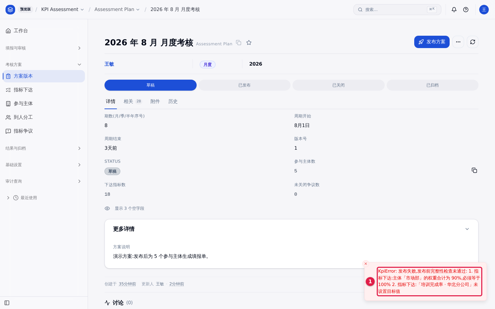

图 29 发布前完整性检查未通过时逐条列出的问题提示

**表 4 发布前完整性检查项与处理办法**

| 检查项 | 提示内容 | 到哪里改 |
|---|---|---|
| 流程节点 | 节点配置不合法(顺序重复、缺必需节点等) | 2.3 节 流程节点 |
| 参与主体 | 至少需要一个考核主体 | 2.4 节 参与主体 |
| 指标下达 | 某主体没有下达任何指标 | 2.5 节 指标下达 |
| 指标下达 | 某主体的权重合计不等于 100% | 2.5 节 指标下达 |
| 指标下达 | 某条下达未设置目标值 | 2.5 节 指标下达 |
| 指标下达 | 存在下达给未参与主体的指标 | 2.4 节 / 2.5 节 |
| 指标争议 | 还有未关闭的指标争议 | 2.7 节 处理指标争议 |

4. 按提示逐条改完后,重新点「发布方案」→「继续」。

**结果确认**:发布成功后右下角提示方案已发布、填报单已生成(见图 30 标注 1);方案详情页的状态条推进到「已发布」,并出现「发布时间」「发布人」;右上角按钮变成「关闭方案」。

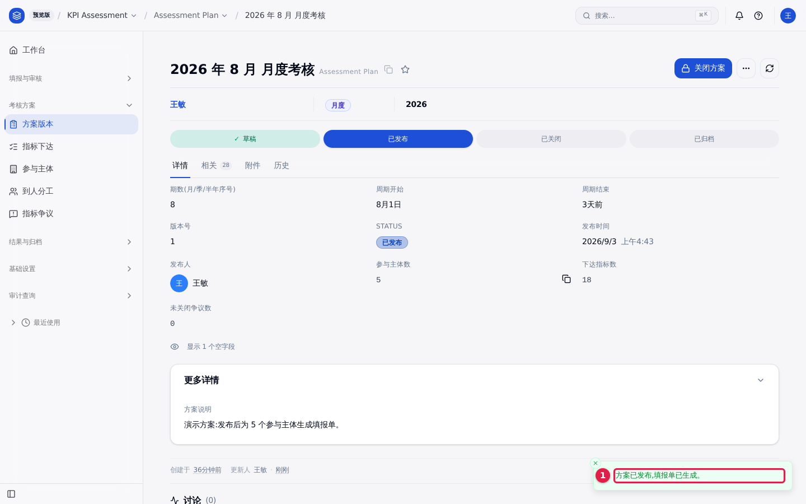

图 30 发布成功后的状态条、发布信息与提示

**常见问题**

- 发布后发现配错了:已发布方案的配置已冻结,先「关闭方案」,再用「复制自版本」建一个新版本改。
- 提示该考核周期已有生效版本:同一周期只允许一个已发布版本,先关闭旧版本。
- 发布后填报单在哪里:左侧菜单「填报与审核」→「填报单」,每个参与主体一张。

## 2.9 人力节点审核与驳回

**场景引入**:分公司核对全部确认后,填报单流转到人力审核环节,由本人逐张审核。

**操作步骤**

1. 点左侧菜单「填报与审核」→「填报单」,点「待人力审核」页签(见图 31 标注 1)。
2. 点填报单名称打开详情;也可以直接用列表行右侧的操作菜单(标注 2)。

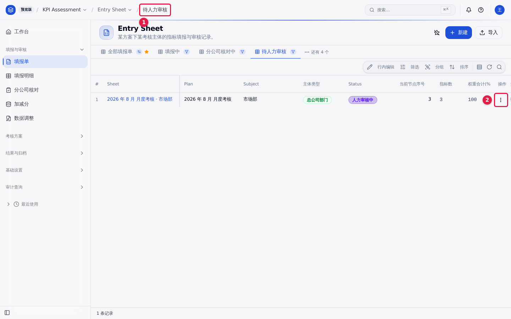

图 31 填报单的「待人力审核」队列与行操作菜单入口

3. 在填报单详情页核对指标得分合计、加减分合计与最终得分,必要时点「相关」页签查看每一行明细。
4. 数据有问题点「驳回」,在窗口中填「驳回原因(必填)」(见图 32 标注 1),点「确认」(标注 2)。

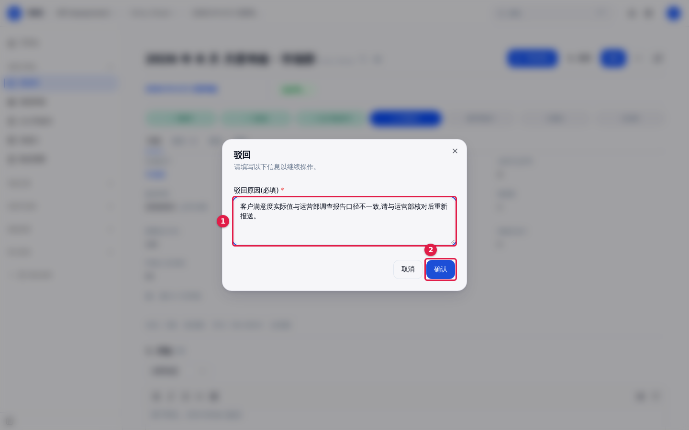

图 32 「驳回」窗口的「驳回原因(必填)」与「确认」按钮

5. 数据无误点「审核通过」,可在「审核意见(选填)」里写一句意见(见图 33 标注 1),点「确认」(标注 2)。

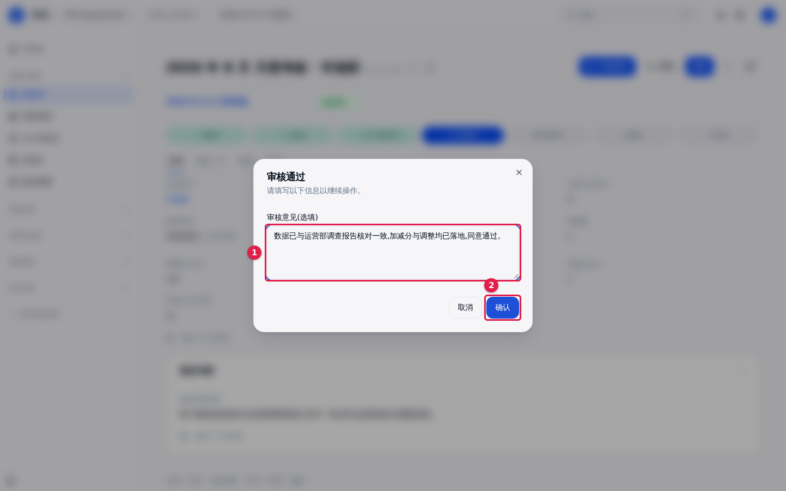

图 33 「审核通过」窗口的「审核意见(选填)」与「确认」按钮

**结果确认**:审核通过后,填报单状态条推进到「领导审批中」;驳回后退回上一节点,填报单详情页的「最近驳回原因」显示刚才填的原因,同时在「审核记录」里留下一条驳回记录。

**常见问题**

- 驳回原因没填:系统会提示驳回原因不能为空,补填后再驳回。
- 驳回退到哪一步:退回本方案流程配置里的上一个节点。上一节点是「分公司核对」时,退回分公司核对;上一节点是「部门填报」时,退回填报中。
- 看不到「审核通过」「驳回」按钮:确认填报单当前状态是「人力审核中」,且本人已分配「人力审核」岗位。

## 2.10 登记加减分

**场景引入**:本期有专项表彰或考核扣分事项,需要在部门得分之外单独加分或扣分。

**操作步骤**

1. 点左侧菜单「填报与审核」→「加减分」,点「新建」。
2. 选「所属填报单」。
3. 填「事项」(见图 34 标注 1),选「类型」(加分 / 扣分,标注 2),填「分值」(标注 3)。
4. 在「依据」里写清依据的制度条款或文件。
5. 点「创建」(标注 4)。

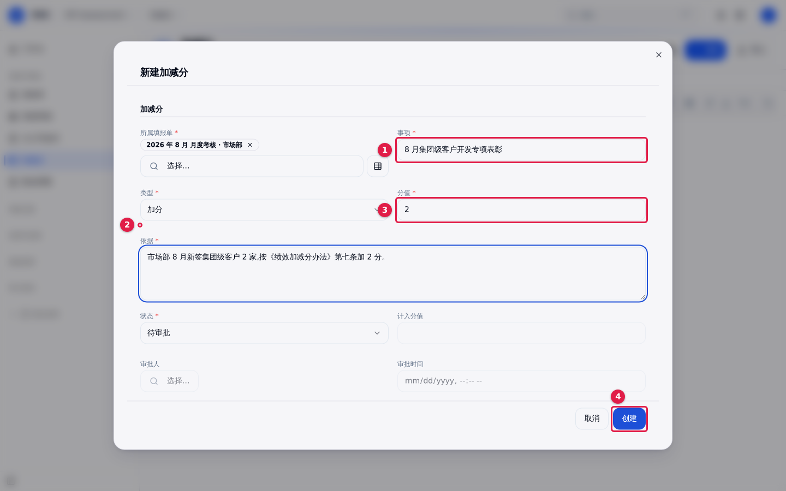

图 34 新建加减分窗口的「事项」「类型」「分值」与「创建」按钮

**结果确认**:加减分列表出现新记录,状态为「待审批」,等人力负责人审批(见第 5 章)。审批通过后计入填报单的「加减分合计」与最终得分。

**常见问题**

- 加减分有没有上限:不封顶也不保底,按登记的分值计入。
- 已归档的填报单还能加减分吗:不能,归档后数据已锁定。
- 记错了怎么办:待审批状态可以直接改;已批准的要先否决再重新登记。

## 2.11 审批数据调整

**场景引入**:填报单提交后数据已冻结,部门发现数据报错时会提交数据调整申请,由本人审批。

**操作步骤**

1. 点左侧菜单「填报与审核」→「数据调整」,点「待审批」页签(见图 35 标注 1)。
2. 核对「调整类型」「调整前值」「调整后值」与「调整原因」。
3. 点该行右侧的操作菜单(标注 2),选「批准并落地」或「否决」。

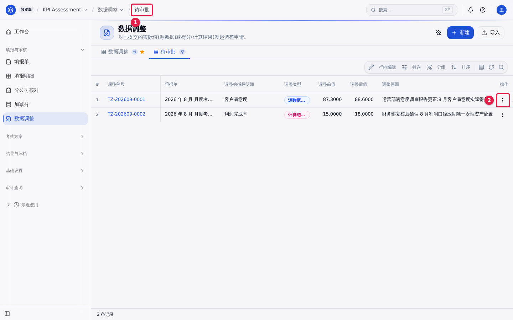

图 35 数据调整「待审批」队列与行操作菜单入口

4. 在窗口中填「审批意见」(见图 36 标注 1),点「确认」(标注 2)。

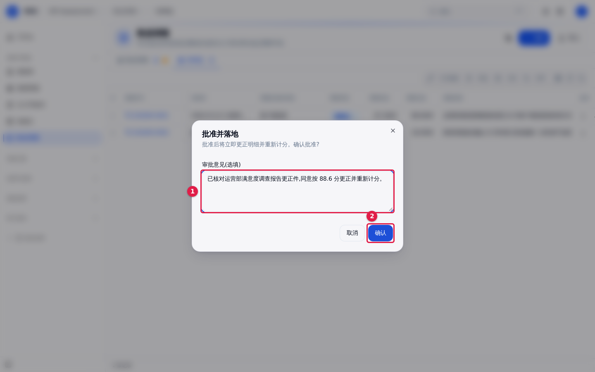

图 36 「批准并落地」窗口的审批意见与「确认」按钮

**两种调整类型的区别**

- 源数据(实际值)调整:批准后直接更正该行的实际值并重新计分。
- 计算结果(得分)调整:批准后只改该行得分,该行标记「已调整」,不直接改主体总分之外的其他数据。

**结果确认**:该申请状态变为「已批准」,出现「审批人」与落地时间;对应填报明细的数值随之更新,「审核记录」里增加一条数据调整留痕。

**常见问题**

- 否决时提示审批意见不能为空:否决必须写原因,补填后再提交。
- 批准后还能撤销吗:不能。已批准并落地的调整不可再改,如需再次更正,请部门重新提交一份调整申请。

## 2.12 归档

**场景引入**:本期考核全部审批通过、结果确认无误后,把填报单归档,形成不可更改的留存记录。

**操作步骤**

1. 打开状态为「已通过」的填报单详情页(见图 37 标注 2)。
2. 点右上角「归档」(标注 1),在确认窗口中点「继续」。

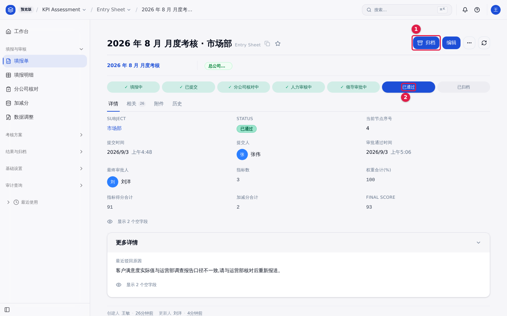

图 37 已通过状态的填报单详情页与「归档」按钮

**结果确认**:填报单状态推进到「已归档」;在左侧菜单「结果与归档」→「归档快照」里出现一条快照记录,含方案、考核主体、最终得分、校验和与归档人(见图 38 标注 1)。

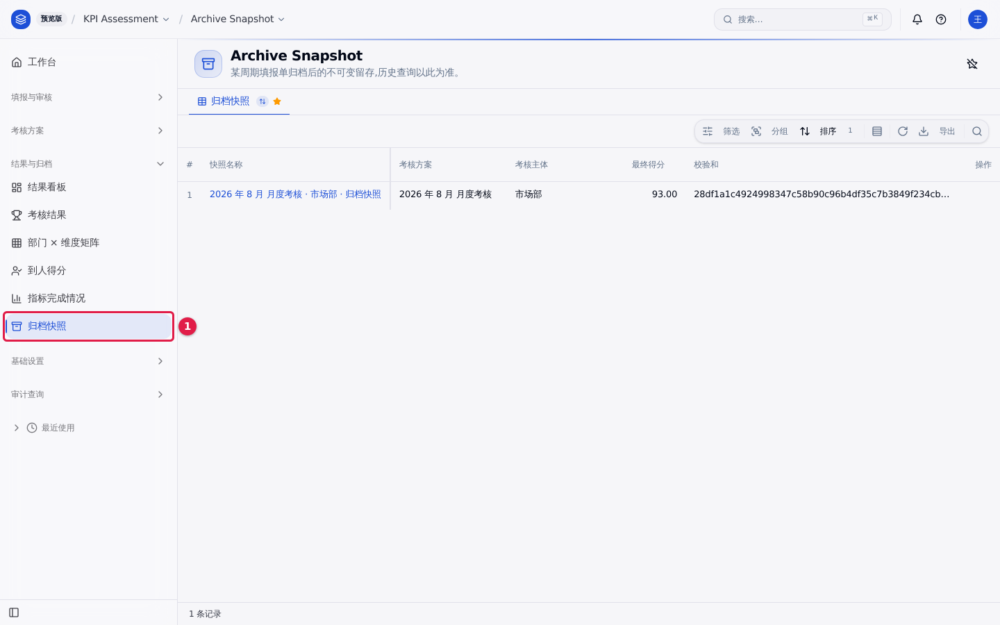

图 38 归档快照列表中的一条快照记录

**常见问题**

- 归档后还能改吗:不能。归档后填报单、明细与加减分全部锁定。
- 归档前还有加减分没批:先让人力负责人批完再归档。
- 归档快照的校验和是做什么的:用于核验快照内容未被改动,查询时可与原记录比对。

## 2.13 审计查询

**场景引入**:上级要了解某张填报单从提交到归档经过了哪些人、哪些环节,或者要核对某次驳回的原因。

**操作步骤**

1. 点左侧菜单「审计查询」→「审核记录」(见图 39 标注 1)。
2. 列表按时间倒序列出每一次流程动作:记录编号、填报单、动作、节点、经办人、原因/意见与时间。
3. 用工具条上的「筛选」(标注 2)按填报单、动作、经办人或时间范围过滤。
4. 要把查询结果交出去,点「导出」(标注 3)。
5. 上方还有两个页签:「驳回记录」只看驳回,「时间线」按时间轴展示。

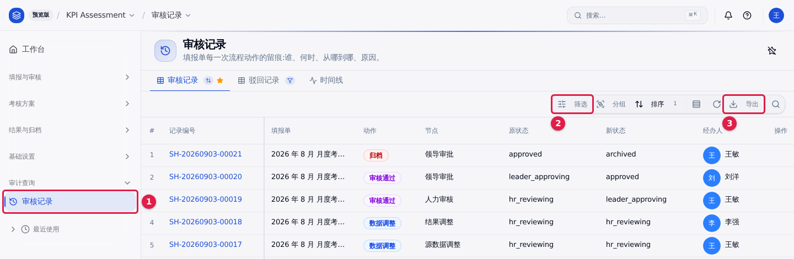

图 39 审核记录列表与「筛选」「导出」

**结果确认**:能查到目标填报单从生成、提交、核对、审核、调整到归档的完整记录,每条都带经办人与时间。

**常见问题**

- 审核记录能改吗:不能,只增不改。
- 查不到某次操作:换用「筛选」放宽条件;加减分与数据调整的审批留痕也在本列表中,动作列显示为「数据调整」等。

---

# 3. 部门填报人员

本章是部门填报人员的全部日常操作:找到本部门的填报单、逐行填实际值、提交,以及被驳回或数据报错时怎么处理。

## 3.1 找到本部门填报单

**场景引入**:收到人力发布方案的通知后,进系统领本部门这一期的填报任务。

**操作步骤**

1. 点左侧菜单「填报与审核」→「填报单」(见图 40 标注 1)。
2. 点「填报中」页签(标注 2),这里是还没提交的填报单。
3. 点填报单名称打开(标注 3)。填报单名称形如「方案名称 · 本部门名称」。

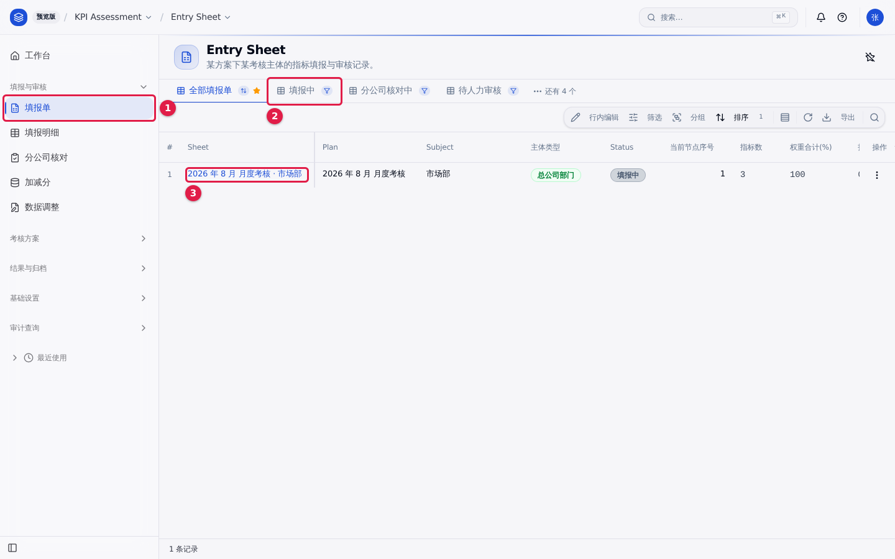

图 40 部门填报人员看到的填报单列表与「填报中」队列

4. 填报单详情页上方是状态条,当前停在「填报中」(见图 41 标注 2);右上角是「提交填报」按钮(标注 1);左侧菜单的「填报明细」(标注 3)是逐行录入实际值的地方。

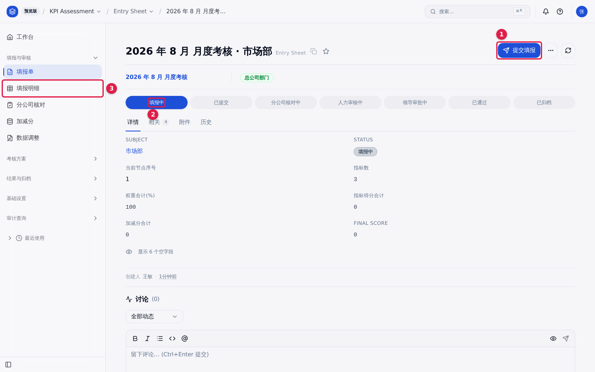

图 41 填报单详情页的状态条与「提交填报」按钮

**结果确认**:能看到本部门这一期的填报单,状态为「填报中」,「指标数」与「权重合计(%)」与人力下达的一致。

**常见问题**

- 列表里一张单子都没有:先确认人力是否已发布本期方案;确认本人账号已加入本部门并分配「部门填报人员」岗位。
- 看到了别的部门的单子吗:看不到。系统按本人所在部门放开可见范围。

## 3.2 逐行填实际值并看计算说明

**场景引入**:月末数据出来后,把每个指标的实际完成值填进系统,系统即时算分。

**操作步骤**

1. 点左侧菜单「填报与审核」→「填报明细」,列表列出本部门填报单的各行指标。
2. 列表默认处于行内编辑状态(见图 42 标注 1)。双击某行的「Actual」(实际值)单元格,输入本期实际值(标注 2)。
3. 逐行填完后,点工具条上的「全部保存」(标注 3)。

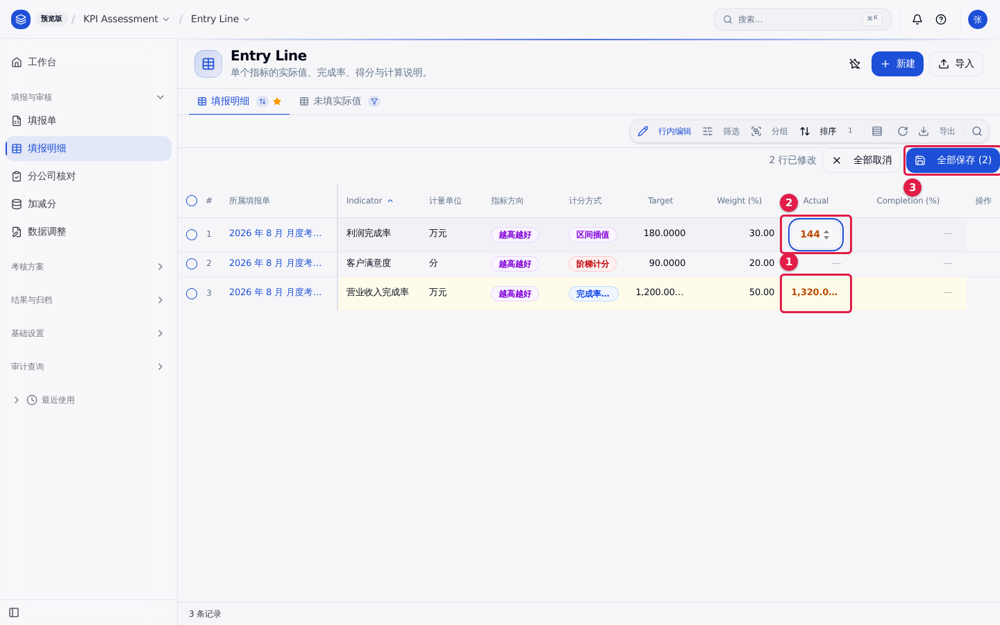

图 42 双击「Actual」(实际值)单元格录入后出现的「全部保存」按钮

4. 保存后系统立刻算出「Completion (%)」(完成率)、得分率与得分。要看清算法,点该行的指标名称打开明细,在「计算说明」里能看到这一行的完整算式(见图 43 标注 1)。

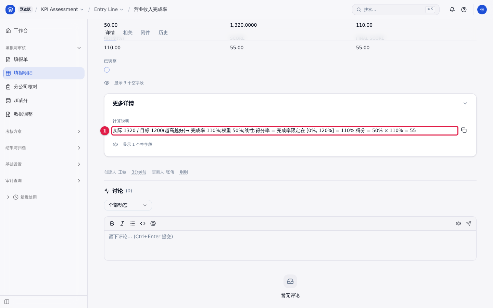

图 43 填报明细记录中的「计算说明」

**结果确认**:每一行都有实际值、完成率与得分;填报单详情页的「指标得分合计」等于各行得分之和。

**常见问题**

- 填完没保存就离开:行内修改要点「全部保存」才写入。
- 得分与自己算的对不上:点开该行看「计算说明」,里面写明了完成率、封顶保底与得分率的取值。
- 「Actual」列在屏幕右侧看不见:列表可以左右滚动;也可以用工具条上的列设置按钮调整显示的列。

## 3.3 批量导入填报明细

**场景引入**:指标条数多、数据来自本部门台账时,用 Excel 一次导入比逐行敲快。

**操作步骤**

1. 在「填报明细」列表点工具条上的「导出」→「导出为 XLSX」,得到一份带现有行的 Excel。
2. 在 Excel 里逐行填好实际值并保存。
3. 回到「填报明细」列表,点右上角「导入」。
4. 第一次导入建议先点「下载模板」(见图 44 标注 1)取得带正确列名的空表。
5. 点「选择文件」(标注 2)选中填好的文件,或把文件拖到虚线框里;再按窗口上方「1. 上传 → 2. 字段映射 → 3. 预览」三步完成导入。

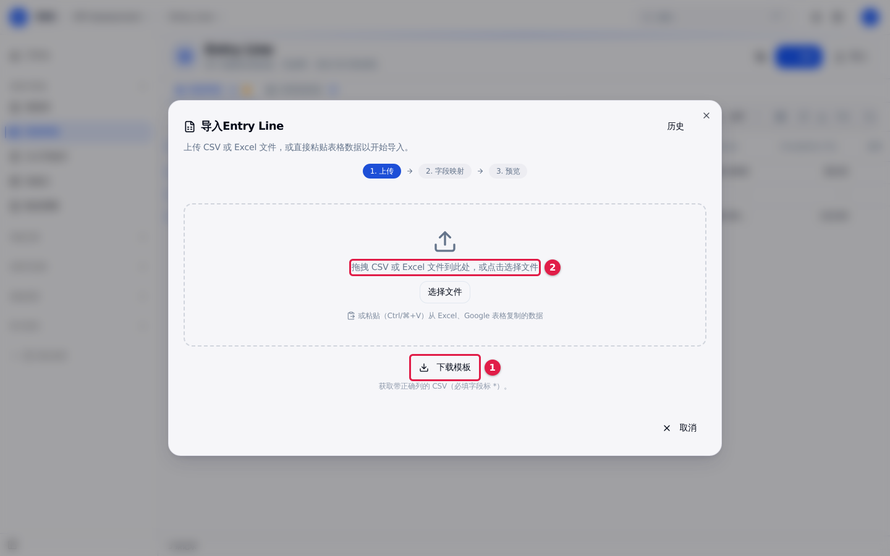

图 44 「导入填报明细」窗口的上传区与「下载模板」

**结果确认**:导入完成后回到列表,各行「Actual」(实际值)与 Excel 中一致,得分同步算出。

**常见问题**

- 导入报字段对不上:在「2. 字段映射」这一步把 Excel 的列名与系统字段一一对应。
- 导入会不会新增出多余的行:导入用于更新已有行,不要在 Excel 里自行增行。

## 3.4 提交填报

**场景引入**:本部门数据全部填完、自查无误后提交,单据进入核对与审核流程。

**操作步骤**

1. 打开填报单详情页,点右上角「提交填报」。
2. 在确认窗口中点「继续」。

**有指标没填时会被拦下**:系统提示还有几个指标未填写实际值,填报单保持「填报中」(见图 45 标注 1)。回到「填报明细」用「未填实际值」页签找出未填的行补齐。

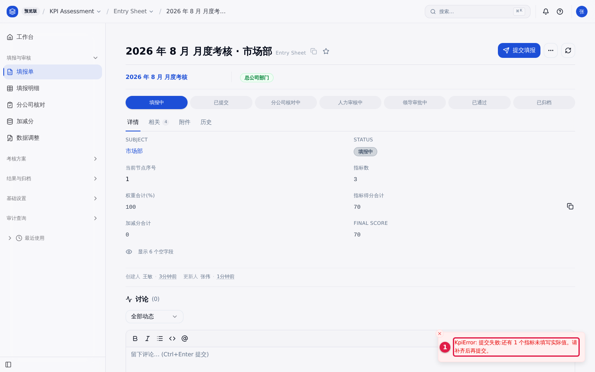

图 45 有指标未填实际值时提交被拦下的提示

3. 补齐后重新点「提交填报」→「继续」。

**结果确认**:提交成功后右下角提示填报单已提交(见图 46 标注 1);状态条推进到「分公司核对中」(方案配了分公司核对节点时)或「人力审核中」;详情页出现「提交时间」与「提交人」。

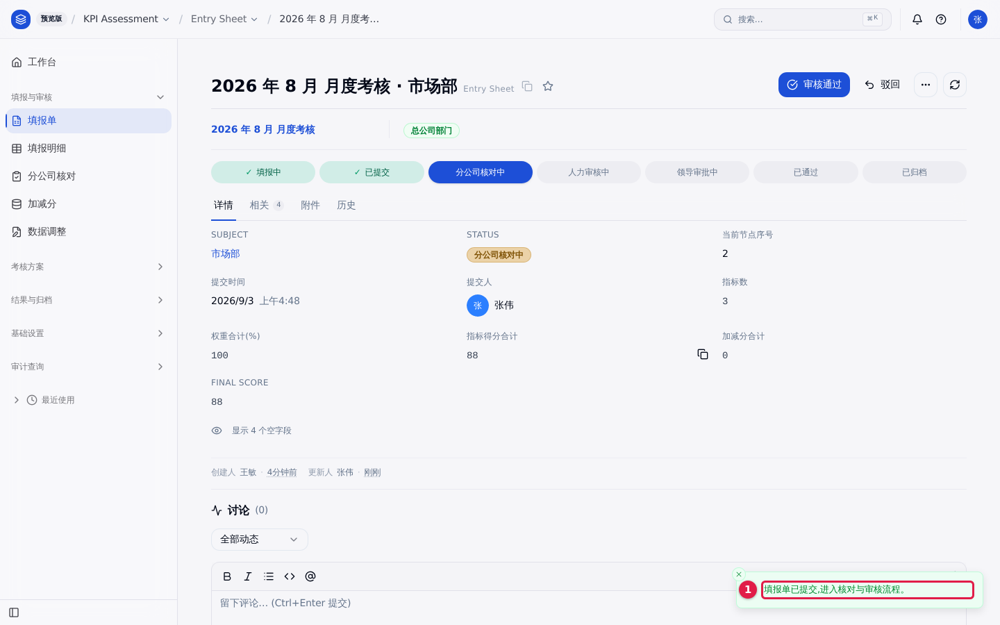

图 46 提交成功后的提示与状态推进

**常见问题**

- 提交后还能改数吗:不能,提交后数据已冻结。要改走 3.6 节的数据调整申请。
- 备注还能补吗:可以,备注不受冻结限制。
- 提交后单子去哪了:在「分公司核对中」或「待人力审核」队列里,可以随时查看进度。

## 3.5 被驳回后怎么改

**场景引入**:人力审核或分管领导审批时发现问题,把单子驳回了,需要按驳回原因处理。

**操作步骤**

1. 打开被驳回的填报单详情页,在「更多详情」区看「最近驳回原因」(见图 47 标注 1),照原因逐条核实。
2. 看单据当前停在哪一步:
   - 状态回到「填报中」的,直接按 3.2 节改实际值,改完按 3.4 节重新提交。
   - 状态回到「分公司核对中」的,填报数据仍处于冻结状态,数值更正要按 3.6 节提交数据调整申请;核对方确认后单据继续往下走。
3. 处理经过与结论,建议在填报单的「讨论」区留言说明,便于审核人复核。

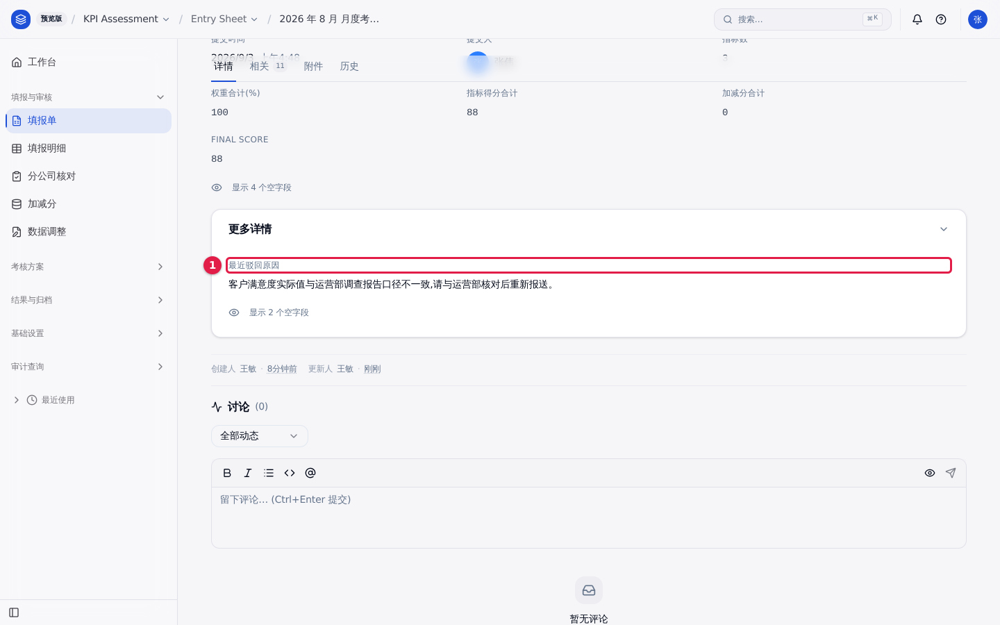

图 47 填报单详情页的「最近驳回原因」

**结果确认**:重新提交或调整落地后,填报单状态继续向后推进;「审核记录」里能查到本次驳回与后续处理的完整过程。

**常见问题**

- 找不到驳回原因:它在填报单详情页的「更多详情」区,标题是「最近驳回原因」;历史每一次驳回都在「审核记录」的「驳回记录」页签里。
- 不认可驳回意见:在填报单「讨论」区说明情况,或线下与审核人沟通后再处理。

## 3.6 发起数据调整申请

**场景引入**:填报单已提交、数据已冻结,但发现某个实际值报错了,需要走调整申请更正。

**操作步骤**

1. 点左侧菜单「填报与审核」→「数据调整」,点「新建」。
2. 选「填报单」和「调整的指标明细」。
3. 选「调整类型」(见图 48 标注 1):报错的是原始数据选「源数据(实际值)」,要更正的是得分选「计算结果(得分)」。
4. 填「调整后值」(标注 2)。「调整前值」由系统自动带出,不用填。
5. 在「调整原因」里写清依据。
6. 点「创建」(标注 3)。

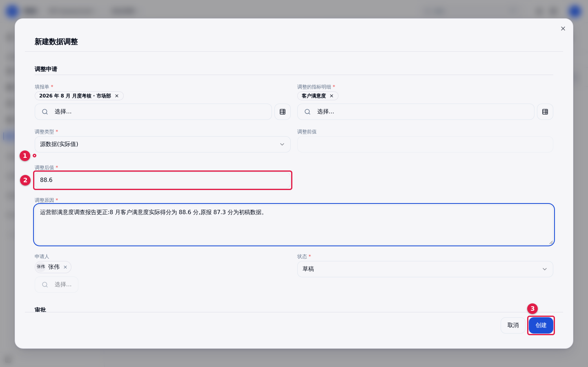

图 48 新建数据调整窗口的「调整类型」「调整后值」与「创建」按钮

7. 新建出来的申请是「草稿」。在数据调整列表点该行右侧的操作菜单,选「提交审批」(见图 49 标注 1)。

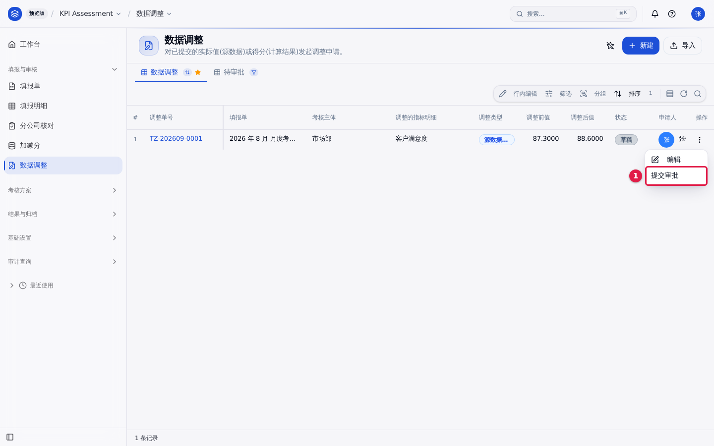

图 49 数据调整行操作菜单中的「提交审批」

**结果确认**:该申请状态从「草稿」变为「待审批」,等人力审核或人力负责人处理。批准落地后,填报明细的数值与得分同步更新。

**常见问题**

- 提交后想撤回:请联系人力审核,由其否决该申请,再重新提交一份。
- 填报单已归档还能调整吗:不能,归档后数据已锁定。
- 一次要改好几行:一行一条申请,逐条提交。

---

# 4. 分公司核对人员

本章是分公司核对人员的全部操作。核对人只对数据表态,不能修改数值 —— 有异议提出争议,由填报部门更正。

## 4.1 找到待我核对的任务

**场景引入**:部门提交填报单后,与本分公司相关的数据会生成一条核对任务,等本人确认。

**操作步骤**

1. 点左侧菜单「填报与审核」→「分公司核对」(见图 50 标注 1)。
2. 点「待我核对」页签(标注 2),这里是还没表态的任务。
3. 每行显示任务名称、对应填报单、核对分公司与核对状态;行右侧是操作菜单(标注 3)。

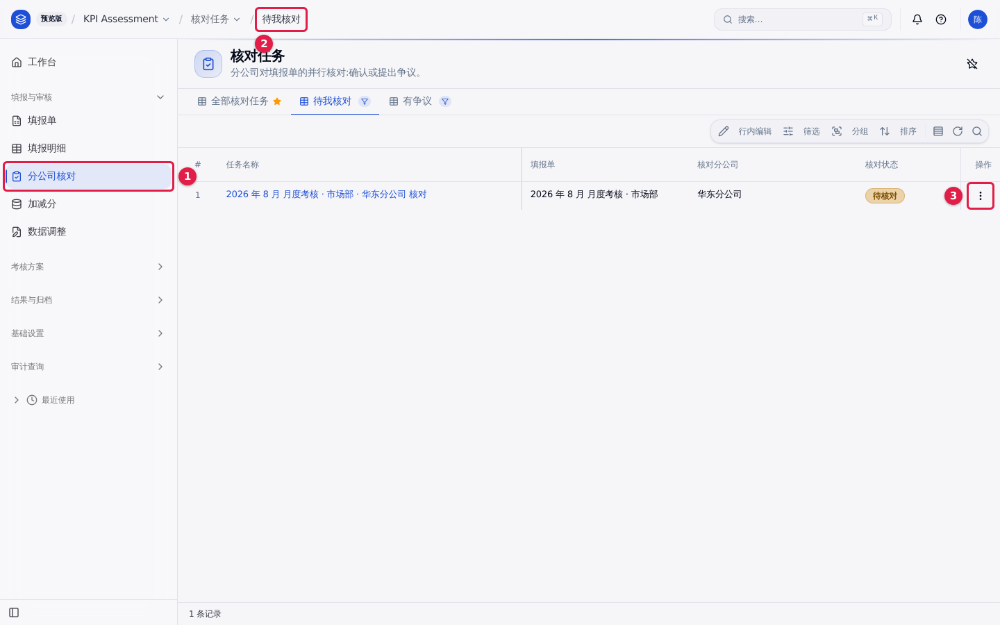

图 50 分公司核对人员的「待我核对」队列

**结果确认**:能看到与本分公司相关的核对任务,状态为「待核对」。

**常见问题**

- 队列是空的:说明相关部门还没有提交填报单,或者本期方案里本分公司不参与核对。
- 看得到别的分公司的任务吗:看不到,系统按本人所在分公司放开可见范围。

## 4.2 核对填报数据

**场景引入**:表态之前,先把填报数据与本分公司台账逐项对一遍。

**操作步骤**

1. 点左侧菜单「填报与审核」→「填报明细」(见图 51 标注 1),查看待核对填报单的每一行指标、目标值、实际值与得分。
2. 与本分公司台账逐项比对,记下有出入的项与差异金额。

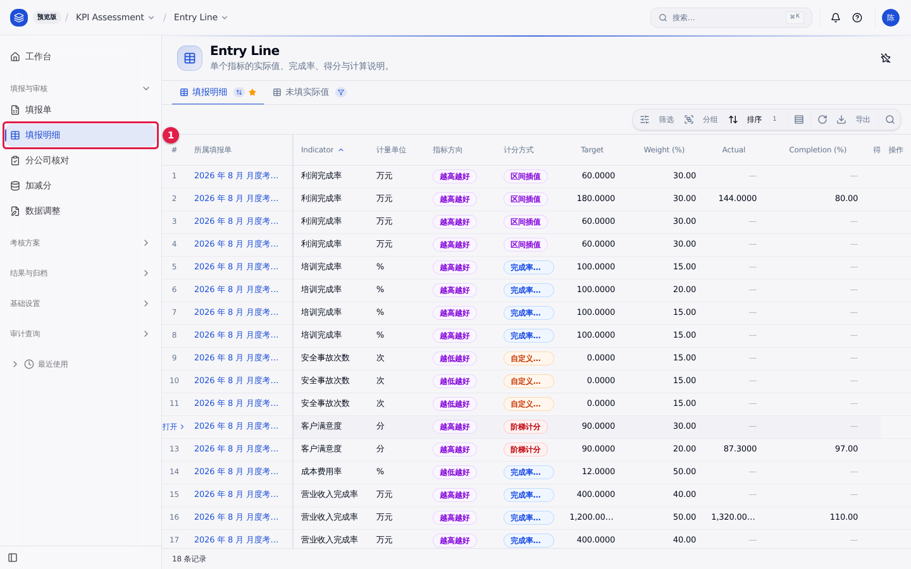

图 51 分公司核对人员查看的填报明细

**结果确认**:每一项都比对完毕,能明确回答「有没有出入、出入在哪一项」。

**常见问题**

- 能不能直接改数:不能。核对人只能确认或提出争议,数值由填报部门更正。
- 明细太宽看不全:列表可以左右滚动,也可以导出成 Excel 再比对。

## 4.3 提出争议

**场景引入**:核对中发现数据与本分公司台账对不上,需要退回给填报部门核实。

**操作步骤**

1. 在「待我核对」队列点该行的操作菜单,选「提出争议」。
2. 在窗口的「争议内容(必填)」里写清哪一项、差多少、依据是什么(见图 52 标注 1)。
3. 点「确认」(标注 2)。

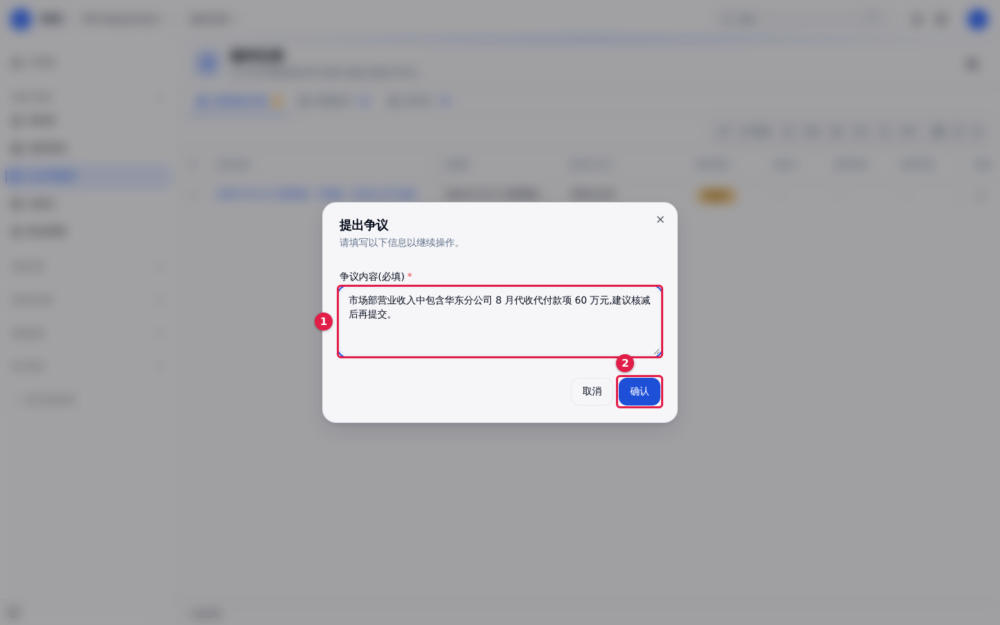

图 52 「提出争议」窗口的「争议内容(必填)」与「确认」按钮

**结果确认**:该核对任务状态变为「有争议」,核对意见显示所填内容;在争议解决前,填报单不会继续往下推进。

**常见问题**

- 争议内容没填:系统会提示核对意见不能为空,补填后再提交。
- 提了争议之后呢:与填报部门核实。对方更正后,回到本队列点「确认无误」,流程继续。

## 4.4 确认无误

**场景引入**:数据核对一致(或争议已协商解决),给出确认,让单据继续往下走。

**操作步骤**

1. 在核对任务列表点该行的操作菜单,选「确认无误」。
2. 在「核对意见(选填)」里写一句核对结论(见图 53 标注 1)。
3. 点「确认」(标注 2)。

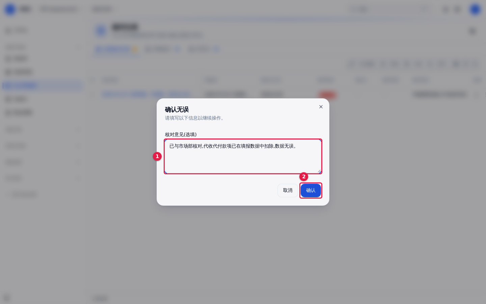

图 53 「确认无误」窗口的「核对意见(选填)」与「确认」按钮

**结果确认**:该任务状态变为「已确认」。本方案涉及的全部分公司都确认后,填报单自动推进到人力审核环节。

**常见问题**

- 确认后能反悔吗:不能。确认前请核对清楚。
- 我确认了单子还没往下走:要等本方案涉及的全部分公司都确认;有一家还是「待核对」或「有争议」,单据就停在核对环节。

---

# 5. 人力负责人

本章是人力负责人的两项审批工作。

## 5.1 审批加减分

**场景引入**:人力审核登记了本期的加分或扣分事项,等本人审批后才计入最终得分。

**操作步骤**

1. 点左侧菜单「填报与审核」→「加减分」(见图 54 标注 1),点「待审批」页签(标注 2)。
2. 核对「事项」「类型」「分值」与「依据」。
3. 点该行右侧的操作菜单(标注 3)。

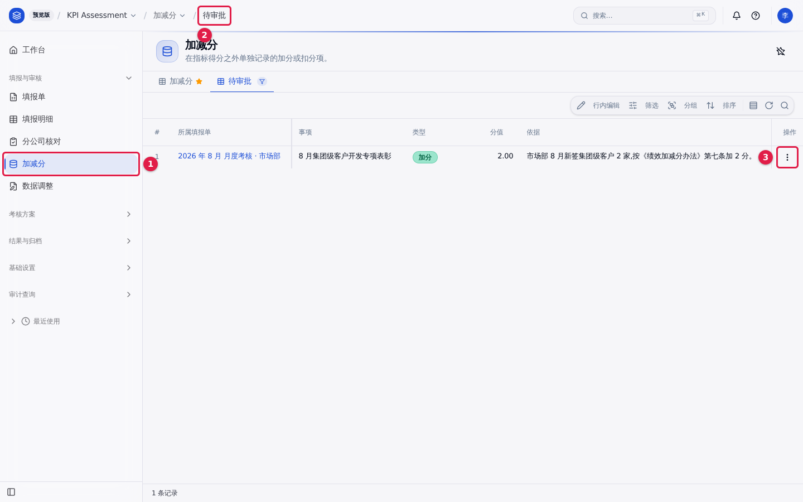

图 54 加减分的「待审批」队列与行操作菜单入口

4. 在菜单中选「批准」(见图 55 标注 1)或「否决」。

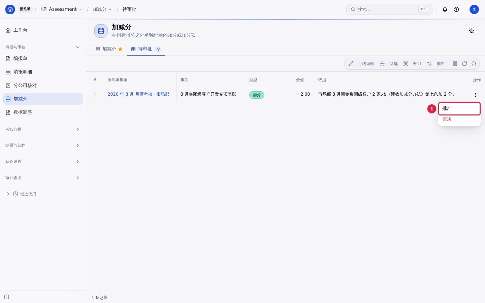

图 55 加减分行操作菜单中的「批准」与「否决」

**结果确认**:该记录状态变为「已批准」,出现审批人与审批时间;对应填报单的「加减分合计」与最终得分随之更新。

**常见问题**

- 批准后发现批错了:已批准的加减分不能再改,先「否决」再由人力审核重新登记。
- 加减分有没有封顶:不封顶也不保底,按登记分值计入。

## 5.2 审批数据调整

**场景引入**:部门提交了数据调整申请,等本人或人力审核批准后才能落地。

**操作步骤**

1. 点左侧菜单「填报与审核」→「数据调整」(见图 56 标注 1),点「待审批」页签。
2. 核对「调整类型」「调整前值」「调整后值」与「调整原因」。
3. 点该行右侧的操作菜单(标注 2),选「批准并落地」或「否决」。

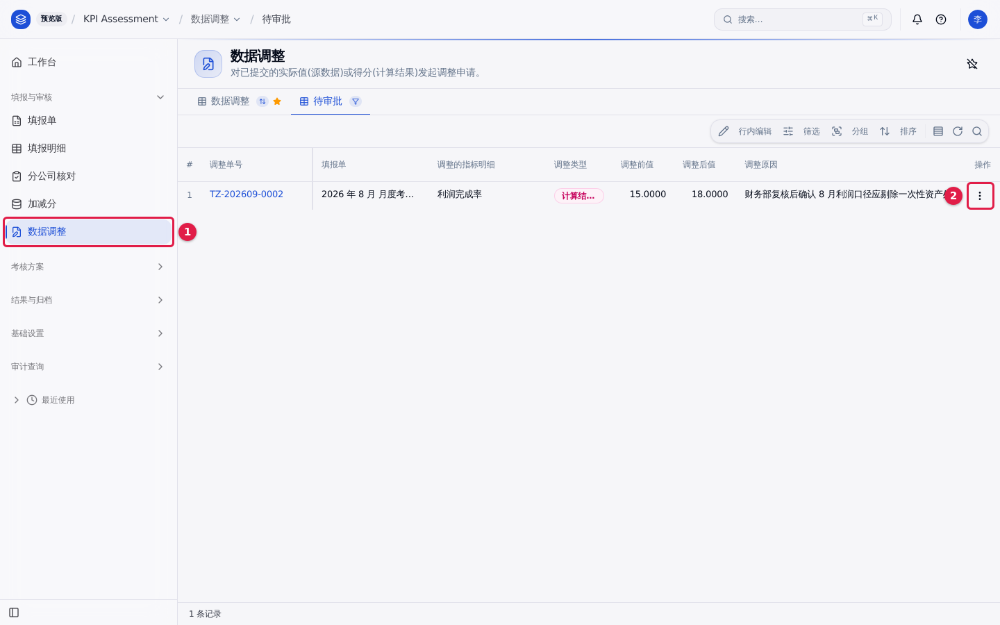

图 56 数据调整的「待审批」队列与行操作菜单入口

4. 在窗口的「审批意见」中写明审批结论(见图 57 标注 1),点「确认」(标注 2)。

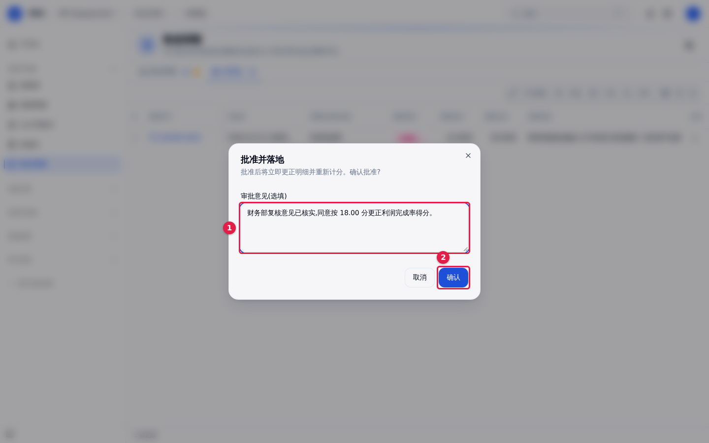

图 57 「批准并落地」窗口的审批意见与「确认」按钮

**结果确认**:该申请状态变为「已批准」,出现审批人与落地时间;对应填报明细的数值与得分同步更新,并在「审核记录」里留痕。

**常见问题**

- 否决时提示审批意见不能为空:否决必须写原因。
- 批准后能撤销吗:不能。已批准并落地的调整不可再改,如需再次更正,请部门重新提交申请。

---

# 6. 分管领导

本章是分管领导的两件事:对分管主体的填报单做最终审批,以及查看分管范围的考核结果。

## 6.1 找到待我审批的填报单

**场景引入**:人力审核通过后,分管主体的填报单流转到本人这里做最终审批。

**操作步骤**

1. 点左侧菜单「填报与审核」→「填报单」(见图 58 标注 1)。
2. 队列页签放不下时,点右侧的「还有 N 个」(标注 2),在其中点「待领导审批」。

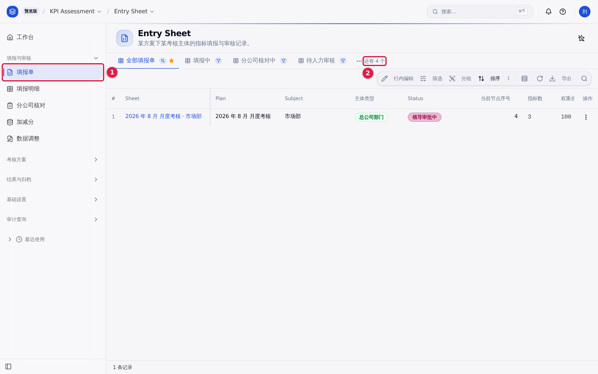

图 58 填报单列表与队列页签的「还有 4 个」入口

3. 「待领导审批」队列里列出等本人审批的填报单,状态显示为「领导审批中」(见图 59 标注 1);行右侧是操作菜单(标注 2)。

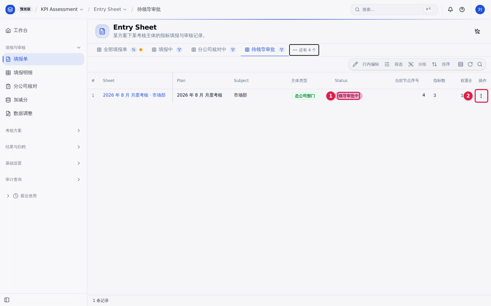

图 59 「待领导审批」队列中的填报单

**结果确认**:队列里只出现本人分管主体的填报单。

**常见问题**

- 队列是空的:说明分管主体的填报单还没有走到领导审批环节。
- 看得到别人分管的主体吗:看不到。可见范围按方案里配置的分管关系确定。

## 6.2 审批通过或驳回

**场景引入**:对分管主体本期的考核结果做最终把关。

**操作步骤**

1. 点填报单名称打开详情,核对指标得分合计、加减分合计与最终得分。
2. 同意的点「审核通过」,在「审核意见(选填)」中写一句意见(见图 60 标注 1),点「确认」(标注 2)。
3. 有问题的点「驳回」,在「驳回原因(必填)」中写明原因后点「确认」。

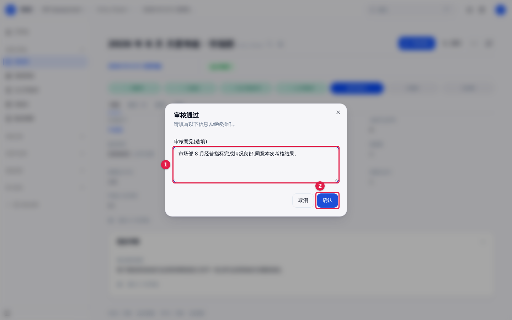

图 60 领导审批的「审核通过」窗口

**结果确认**:通过后填报单状态推进到「已通过」,详情页出现「审批通过时间」与「最终审批人」;系统同时生成部门、分公司、到人、分管领导四个维度的考核结果。驳回则退回上一节点,并在「审核记录」中留痕。

**常见问题**

- 驳回原因不填能提交吗:不能,驳回必须填原因。
- 通过之后还能改吗:不能。通过后填报数据只读,如需更正走数据调整申请。

## 6.3 查看分管主体结果与看板

**场景引入**:审批完成后,了解分管范围本期的整体得分与排名。

**操作步骤**

1. 点左侧菜单「结果与归档」→「考核结果」(见图 61 标注 1)。列表按维度列出结果,「分管领导」维度是本人分管范围的加权结果(标注 2);上方还有「部门」「分公司」「到人」「分管领导」四个页签。

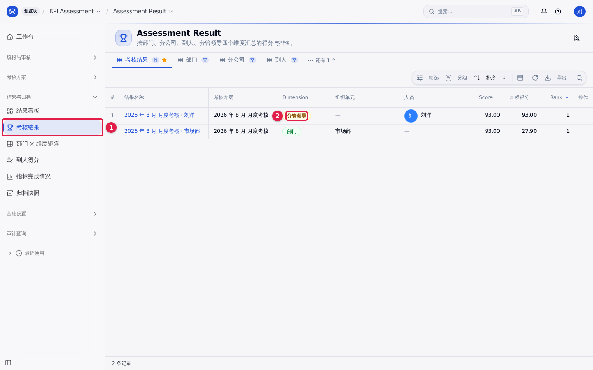

图 61 考核结果列表中的「部门」与「分管领导」两条结果

2. 点左侧菜单「结果与归档」→「结果看板」(见图 62 标注 1),看结果条数、平均得分、最高得分、最低得分与各组织单元平均得分。
3. 用页面上方的「汇总维度」下拉(标注 2)切换只看某一个维度。

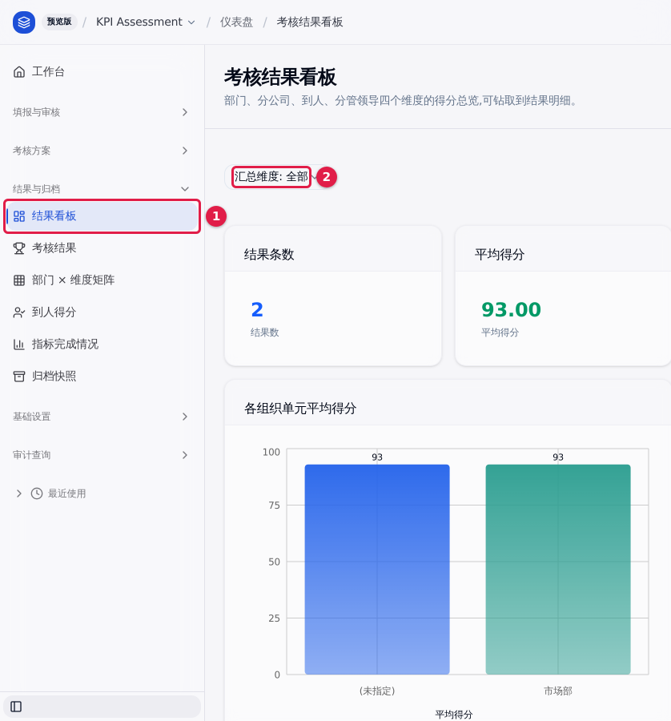

图 62 考核结果看板的统计卡片与各组织单元平均得分

**汇总口径**

- 部门 / 分公司:填报单最终得分,组内排名。
- 到人:Σ(部门板块得分 × 分工权重 × 个人系数) + Σ(承接项得分率 × 承接权重)。
- 分管领导:分管主体得分按主体权重加权平均;主体权重全空时按算术平均。

**结果确认**:能看到本期分管范围的得分与排名,且与各主体填报单的最终得分对得上。

**常见问题**

- 看板上没有数:本期还没有填报单审批通过;审批通过后结果自动生成。
- 结果数字与填报单对不上:加减分与数据调整落地后会重算,请刷新页面。
- 想看某个部门的明细:在考核结果列表点该行,可以钻取到对应的填报单与指标明细。

---

# 7. 常见问题总表

**表 5 按角色汇总的常见问题与处理办法**

| 角色 | 现象 | 先自己做什么 | 还不行找谁 |
|---|---|---|---|
| 全部 | 登录不上 | 核对邮箱有无空格,确认密码 | 管理员重置密码 |
| 全部 | 登录后看不到考核菜单 | 确认用的是本人账号 | 管理员分配岗位 |
| 全部 | 列表里一条数据都没有 | 换一个队列页签,清掉筛选条件 | 本环节的上游经办人 |
| 全部 | 行内改完数据没保存住 | 点工具条上的「全部保存」 | — |
| 人力审核 | 方案发布被拦下 | 按提示逐条改:权重合计 100%、目标值齐全、争议关闭、节点合法 | 提出争议的分公司 |
| 人力审核 | 发布后要改配置 | 关闭方案,用「复制自版本」建新版本 | 业务顾问确认口径 |
| 人力审核 | 看不到「审核通过」「驳回」 | 确认填报单当前状态是「人力审核中」 | 管理员核对岗位 |
| 部门填报人员 | 找不到本部门填报单 | 确认人力已发布本期方案 | 人力审核 |
| 部门填报人员 | 提交被拦 | 用「未填实际值」页签找出未填行补齐 | — |
| 部门填报人员 | 提交后要改数 | 提交数据调整申请 | 人力审核审批 |
| 部门填报人员 | 单子被驳回 | 看「最近驳回原因」,按原因处理 | 驳回人 |
| 分公司核对人员 | 数据对不上 | 点「提出争议」写清差异 | 填报部门 |
| 分公司核对人员 | 确认了单子仍不推进 | 查看是否还有其他分公司未确认 | 未确认的分公司 |
| 人力负责人 | 加减分批错了 | 先「否决」,由人力审核重新登记 | 人力审核 |
| 人力负责人 | 调整批准后要撤销 | 不能撤销,让部门重新提交一份 | 部门填报人员 |
| 分管领导 | 待审批队列是空的 | 确认单据已过人力审核 | 人力审核 |
| 分管领导 | 看不到某个主体 | 确认本人是该主体在本期方案里的分管领导 | 人力审核 |

---

# 附录 A 手册章节与界面对照索引

界面改版时按本表定位受影响的章节,逐节复核并更新截图。

**表 6 手册章节与界面对照索引**

| 章节 | 界面 / 按钮 | 截图文件名 |
|---|---|---|
| 1.1 | 登录页 —— 邮箱 / 密码 / 登录 | 01-01-denglu.png |
| 1.2 | 工作台 —— 左侧菜单分组 / 个人菜单 | 01-02-gongzuotai.png |
| 1.3 | 顶部应用名 —— 切换应用 | 01-03-qiehuan-yingyong.png |
| 1.4 | 填报单列表 —— 队列页签 / 还有 N 个 | 01-04-daiban-duilie.png |
| 1.5 | 个人资料 —— 修改密码 | 01-05-xiugai-mima.png |
| 1.6 | 列表工具条 —— 导出 | 01-06-daochu-excel.png |
| 2.1 | 指标库列表 —— 新建 / 导入 / 导出 | 02-01-zhibiaoku-liebiao.png |
| 2.1 | 新建指标 —— 基本信息 / 计分规则 | 02-02-xinjian-zhibiao-shangban.png |
| 2.1 | 新建指标 —— 阶梯区间 / 创建 | 02-03-xinjian-zhibiao-jieti.png |
| 2.1 | 指标详情 —— 计分规则字段 / 相关 | 02-04-zhibiao-xiangqing.png |
| 2.1 | 指标相关 —— 阶梯区间 | 02-05-jieti-qujian.png |
| 2.2 | 方案版本列表 —— 新建 / 草稿页签 | 02-06-fangan-liebiao.png |
| 2.2 | 新建方案 —— 方案信息 / 复制自版本 | 02-07-xinjian-fangan.png |
| 2.2 | 新建方案 —— 指标下达 / 审核流程节点 | 02-08-xiada-yu-jiedian-wangge.png |
| 2.2 | 新建方案 —— 参与主体 / 到人分工 / 创建 | 02-09-zhuti-yu-fengong-wangge.png |
| 2.2 | 方案详情 —— 状态条 / 发布方案 / 相关 | 02-10-fangan-xiangqing.png |
| 2.3 | 方案相关 —— 流程节点 | 02-11-liucheng-jiedian.png |
| 2.4 | 方案相关 —— 参与主体 | 02-12-canyu-zhuti.png |
| 2.4 | 参与主体列表 —— 分管领导行内编辑 | 02-13-shezhi-fenguan-lingdao.png |
| 2.4 | 参与主体列表 —— 全部保存 | 02-14-baocun-fenguan-lingdao.png |
| 2.5 | 指标下达列表 —— 行内编辑 / 全部保存 | 02-15-xiada-hangnei-bianji.png |
| 2.5 | 指标下达列表 —— 导出 | 02-16-daochu-excel.png |
| 2.5 | 导入指标下达 —— 下载模板 / 选择文件 | 02-17-daoru-duihuakuang.png |
| 2.6 | 新建到人分工 —— 员工 / 分工权重 / 个人系数 | 02-18-daoren-fengong-xinjian.png |
| 2.6 | 新建到人分工 —— 个人承接项 / 创建 | 02-19-geren-chengjie-xiang.png |
| 2.7 | 指标争议 —— 待处理队列 / 行操作菜单 | 02-20-zhengyi-daichuli.png |
| 2.7 | 采纳窗口 —— 处理结论 / 确认 | 02-21-caina-zhengyi.png |
| 2.8 | 发布方案 —— 确认窗口 / 继续 | 02-22-fabu-queren.png |
| 2.8 | 发布方案 —— 完整性检查未通过提示 | 02-23-fabu-jiancha-butongguo.png |
| 2.8 | 方案详情 —— 已发布状态与发布信息 | 02-24-fabu-chenggong.png |
| 2.9 | 填报单 —— 待人力审核队列 | 02-25-renli-shenhe-duilie.png |
| 2.9 | 驳回窗口 —— 驳回原因 / 确认 | 02-26-bohui-duihuakuang.png |
| 2.9 | 审核通过窗口 —— 审核意见 / 确认 | 02-27-shenhe-tongguo.png |
| 2.10 | 新建加减分 —— 事项 / 类型 / 分值 / 创建 | 02-28-dengji-jiajianfen.png |
| 2.11 | 数据调整 —— 待审批队列 / 行操作菜单 | 02-29-shenpi-shuju-tiaozheng.png |
| 2.11 | 批准并落地窗口 —— 审批意见 / 确认 | 02-30-pizhun-luodi.png |
| 2.12 | 填报单详情 —— 归档按钮 | 02-31-guidang.png |
| 2.12 | 归档快照列表 | 02-32-guidang-kuaizhao.png |
| 2.13 | 审核记录 —— 筛选 / 导出 / 页签 | 02-33-shenji-chaxun.png |
| 3.1 | 填报单列表 —— 填报中队列 | 03-01-tianbaodan-liebiao.png |
| 3.1 | 填报单详情 —— 状态条 / 提交填报 | 03-02-tianbaodan-xiangqing.png |
| 3.2 | 填报明细 —— 实际值行内编辑 / 全部保存 | 03-03-luru-shijizhi.png |
| 3.2 | 填报明细记录 —— 计算说明 | 03-04-jisuan-shuoming.png |
| 3.3 | 导入填报明细 —— 下载模板 / 选择文件 | 03-05-daoru-mingxi.png |
| 3.4 | 提交填报 —— 未填全被拦提示 | 03-06-tijiao-beilan.png |
| 3.4 | 提交填报 —— 成功提示与状态推进 | 03-07-tijiao-chenggong.png |
| 3.5 | 填报单详情 —— 最近驳回原因 | 03-08-bohui-yuanyin.png |
| 3.6 | 新建数据调整 —— 调整类型 / 调整后值 / 创建 | 03-09-faqi-shuju-tiaozheng.png |
| 3.6 | 数据调整 —— 提交审批 | 03-10-tijiao-shenpi.png |
| 4.1 | 分公司核对 —— 待我核对队列 | 04-01-daiwo-hedui.png |
| 4.2 | 填报明细 —— 核对依据 | 04-02-chakan-tianbao-mingxi.png |
| 4.3 | 提出争议窗口 —— 争议内容 / 确认 | 04-03-tichu-zhengyi.png |
| 4.4 | 确认无误窗口 —— 核对意见 / 确认 | 04-04-queren-wuwu.png |
| 5.1 | 加减分 —— 待审批队列 | 05-01-jiajianfen-daishenpi.png |
| 5.1 | 加减分行操作菜单 —— 批准 / 否决 | 05-02-pizhun-jiajianfen.png |
| 5.2 | 数据调整 —— 待审批队列 | 05-03-shuju-tiaozheng-daishenpi.png |
| 5.2 | 批准并落地窗口 | 05-04-pizhun-jieguo-tiaozheng.png |
| 6.1 | 填报单列表 —— 队列页签溢出入口 | 06-01-lingdao-duilie-rukou.png |
| 6.1 | 待领导审批队列 | 06-02-lingdao-shenpi-duilie.png |
| 6.2 | 领导审批 —— 审核通过窗口 | 06-03-lingdao-shenpi-tongguo.png |
| 6.3 | 考核结果列表 —— 分管领导维度 | 06-04-fenguan-zhuti-jieguo.png |
| 6.3 | 考核结果看板 —— 统计卡片 / 汇总维度 | 06-05-jieguo-kanban.png |

---

# 附录 B 各角色练习任务清单

培训现场布置,限期完成。每项的完成标准都是系统里查得到的结果,由核验人登录系统查记录认定。练习在培训环境完成,不在正式环境操作。

**表 7 人力审核练习任务**

| 序号 | 练习任务 | 完成标准(系统里查得到) |
|---|---|---|
| 2-1 | 新建一条阶梯计分的指标,含四段阶梯区间 | 指标库中存在该指标,状态为「启用」,其「相关」页签下有 4 条阶梯区间 |
| 2-2 | 用「复制自版本」新建下一期方案版本 | 方案列表中存在新版本,状态为「草稿」,其流程节点、参与主体、指标下达条数与被复制版本一致 |
| 2-3 | 给一个考核主体配置分管领导,并把该主体的权重合计调整到 100% | 参与主体列表中该主体的「分管领导」显示指定人员;指标下达中该主体各行权重合计为 100 |
| 2-4 | 制造一次发布失败并改到发布成功 | 首次发布出现完整性检查未通过提示;改正后方案状态为「已发布」,且生成的填报单数量等于参与主体数 |
| 2-5 | 对一张已提交的填报单先驳回再审核通过 | 审核记录中存在该填报单的一条「驳回」与一条「审核通过」记录,驳回记录带原因 |

**表 8 部门填报人员练习任务**

| 序号 | 练习任务 | 完成标准(系统里查得到) |
|---|---|---|
| 3-1 | 在本部门填报单里逐行录入实际值 | 填报明细各行「Actual」(实际值)非空,且完成率与得分已算出 |
| 3-2 | 故意漏填一行后提交,再补齐提交 | 首次提交出现未填实际值的提示;补齐后填报单状态推进到下一节点,且有「提交时间」「提交人」 |
| 3-3 | 查看一条明细的计算说明并复述算式 | 能指出该行「计算说明」中的完成率、得分率与得分三个数,且与列表数值一致 |
| 3-4 | 对已提交的一行提交数据调整申请 | 数据调整列表中存在该申请,状态为「待审批」,调整前值由系统带出 |

**表 9 分公司核对人员练习任务**

| 序号 | 练习任务 | 完成标准(系统里查得到) |
|---|---|---|
| 4-1 | 在「待我核对」里找到本分公司的核对任务 | 能说出任务名称与对应填报单名称 |
| 4-2 | 对一条任务提出争议 | 该任务状态为「有争议」,核对意见为所填内容 |
| 4-3 | 协商后把该任务改为确认无误 | 该任务状态为「已确认」 |

**表 10 人力负责人练习任务**

| 序号 | 练习任务 | 完成标准(系统里查得到) |
|---|---|---|
| 5-1 | 审批一条加减分 | 该加减分状态为「已批准」,填报单「加减分合计」随之变化 |
| 5-2 | 否决一条数据调整申请 | 该申请状态为「已否决」,且带审批意见 |
| 5-3 | 批准一条数据调整申请 | 该申请状态为「已批准」并有落地时间,对应填报明细数值已更新 |

**表 11 分管领导练习任务**

| 序号 | 练习任务 | 完成标准(系统里查得到) |
|---|---|---|
| 6-1 | 在「待领导审批」里找到分管主体的填报单 | 能说出填报单名称与最终得分 |
| 6-2 | 审批通过一张填报单 | 该填报单状态为「已通过」,有「审批通过时间」与「最终审批人」 |
| 6-3 | 在考核结果里找到本人的分管领导维度得分 | 考核结果列表中存在「分管领导」维度的一行,得分与分管主体加权结果一致 |
